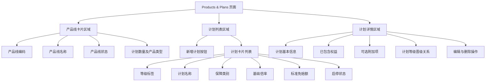
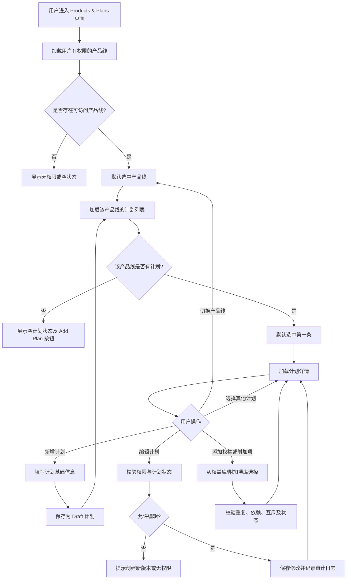
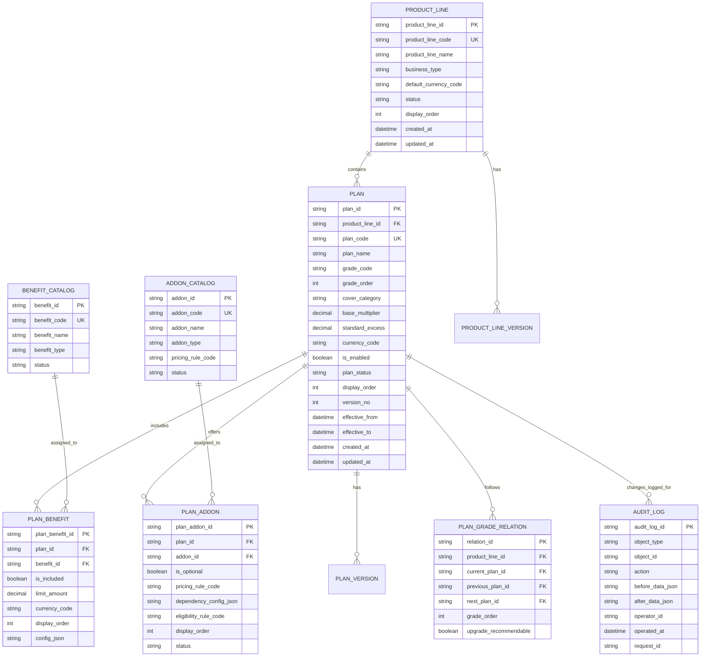

## Product Lines & Plans功能页面

### 【页面整体布局】
| 区域     | 位置    | 主要内容                    | 交互目的             |
| ------ | ----- | ----------------------- | ---------------- |
| 产品线区域  | 页面上方  | 产品线卡片列表                 | 切换当前查看的产品线       |
| 计划列表区域 | 左侧主区域 | 当前产品线下的计划卡片、计划开关、新增计划按钮 | 选择、新增或快速查看某个计划   |
| 计划详情区域 | 右侧主区域 | 计划基础信息、权益、附加项、等级晋级关系    | 查看和编辑当前选中计划的详细配置 |

### 【页面信息架构】

### 【角色定义】

| 角色    | 主要职责                         |
| ----- | ---------------------------- |
| 产品经理  | |
| Viewer  | 查看可售产品与计划，查看产品与计划配置，确认保障类别、核保适用范围及可售状态     |
| Approver  | 对已审批的配置进行发布、下架、回滚  |
| User  | 创建产品线、维护计划结构、维护保障权益、配置产品展示信息，查看可售产品与计划，配置渠道展示或运营标签，维护基础倍率、免赔额相关配置，确认计划定价相关字段        |
| Power Admin | 管理用户、角色、权限和基础字典           |
| Admin | 查看产品、计划及配置变更历史     |

### 【权限矩阵---待修改】
| 操作       | 产品经理 | 精算人员 | 核保人员 | 运营人员 | 发布管理员 | 审计用户 |
| -------- | ---- | ---- | ---- | ---- | ----- | ---- |
| 查看产品线列表  | 是    | 是    | 是    | 是    | 是     | 是    |
| 查看计划详情   | 是    | 是    | 是    | 是    | 是     | 是    |
| 新增产品线    | 是    | 否    | 否    | 否    | 否     | 否    |
| 新增计划     | 是    | 可选   | 否    | 否    | 否     | 否    |
| 编辑计划基本资料 | 是    | 否    | 可选   | 否    | 否     | 否    |
| 编辑基础倍率   | 可选   | 是    | 否    | 否    | 否     | 否    |
| 编辑标准免赔额  | 可选   | 是    | 是    | 否    | 否     | 否    |
| 配置已包含权益  | 是    | 否    | 是    | 可选   | 否     | 否    |
| 配置可选附加项  | 是    | 可选   | 是    | 可选   | 否     | 否    |
| 启用/停用计划  | 否    | 否    | 否    | 否    | 是     | 否    |
| 查看审计记录   | 是    | 是    | 是    | 否    | 是     | 是    |
| 发布/回滚版本  | 否    | 否    | 否    | 否    | 是     | 否    |

### 【状态流转图】

### 【数据库设计】

#### 【产品列表】
| 字段名称（语义）  | 字段名词（field name）        | 类型              | 必填 | 说明                                                      | 字段约束                                              |
| --------- | ----------------------- | --------------- | -- | ------------------------------------------------------- | ------------------------------------------------- |
| 产品线主键     | product_line_id         | BIGINT UNSIGNED | 是  | 产品线唯一 ID                                                | 主键；自增或雪花 ID；不可修改                                  |
| 产品线编码     | product_line_code       | VARCHAR(64)     | 是  | 系统唯一编码，例如 RT-FLEET                                      | 唯一索引；建议仅允许大写字母、数字、-、_；不可重复                        |
| 产品线名称     | product_line_name       | VARCHAR(128)    | 是  | 产品线展示名称，例如 RoadTrust Fleet                              | 建议在同一业务域内唯一；长度 1–128                              |
| 产品线简称     | product_line_short_name | VARCHAR(64)     | 否  | 适用于卡片、下拉框、移动端等短文本展示                                     | 长度不超过 64                                          |
| 产品线描述     | description             | TEXT            | 否  | 对产品线适用场景、目标客户和定位的业务说明                                   | 不建议保存完整保险条款；完整条款应关联文档库                            |
| 保险业务类型    | business_type           | VARCHAR(32)     | 是  | 如 PERSONAL、FLEET_COMMERCIAL、ELECTRIC_VEHICLE、MOTORCYCLE | 建议关联业务类型字典表                                       |
| 险种代码      | insurance_type_code     | VARCHAR(32)     | 是  | 如机动车险可为 MOTOR_INSURANCE                                 | 建议关联险种字典表                                         |
| 产品线图标     | icon_code               | VARCHAR(64)     | 否  | 前端卡片图标标识，如 fleet、electric_vehicle                       | 不保存图片二进制；保存图标编码或资源 URL                            |
| 默认币种      | default_currency_code   | CHAR(3)         | 是  | 默认保费、免赔额和保额展示币种，例如 HKD、CNY                              | 应符合 ISO 4217；建议关联币种字典                             |
| 适用地区      | region_code             | VARCHAR(32)     | 否  | 产品线默认适用地区，例如 HK、CN、APAC                                 | 建议关联地区字典；多地区场景建议另建关联表                             |
| 产品线状态     | status                  | VARCHAR(32)     | 是  | 产品线当前生命周期状态，如 DRAFT、LIVE、SUSPENDED、RETIRED              | 默认 DRAFT；建议建立状态检查约束                               |
| 是否启用      | is_enabled              | TINYINT(1)      | 是  | 业务开关；1=启用，0=停用                                          | 默认 0；产品线为 LIVE 时通常应为 1                            |
| 是否允许新报价   | is_quote_enabled        | TINYINT(1)      | 是  | 是否允许报价系统读取该产品线用于新报价                                     | 默认 0；暂停销售时应为 0                                    |
| 是否允许新投保   | is_application_enabled  | TINYINT(1)      | 是  | 是否允许新投保/新出单                                             | 默认 0；与渠道、核保规则共同决定最终可售性                            |
| 默认计划 ID   | default_plan_id         | BIGINT UNSIGNED | 否  | 该产品线默认推荐或默认选中的计划                                        | 外键关联 plan.plan_id；计划必须属于当前产品线                     |
| 展示排序      | display_order           | INT UNSIGNED    | 是  | 控制产品线卡片展示顺序                                             | 默认 0；建议建立普通索引                                     |
| 当前生效版本 ID | current_version_id      | BIGINT UNSIGNED | 否  | 指向当前已发布的产品线版本                                           | 外键关联 product_line_version.product_line_version_id |
| 生效开始时间    | effective_from          | DATETIME        | 否  | 当前产品线配置开始生效时间                                           | 小于 effective_to；统一采用业务时区                          |
| 生效结束时间    | effective_to            | DATETIME        | 否  | 产品线配置失效时间；为空表示长期有效                                      | 必须大于 effective_from                               |
| 创建人 ID    | created_by              | BIGINT UNSIGNED | 是  | 创建该产品线的后台用户 ID                                          | 外键关联用户表                                           |
| 创建时间      | created_at              | DATETIME        | 是  | 记录创建时间                                                  | 默认 CURRENT_TIMESTAMP                              |
| 更新人 ID    | updated_by              | BIGINT UNSIGNED | 是  | 最后修改该产品线的用户 ID                                          | 外键关联用户表                                           |
| 更新时间      | updated_at              | DATETIME        | 是  | 最后修改时间                                                  | 默认自动更新                                            |
| 行版本号      | row_version             | INT UNSIGNED    | 是  | 乐观锁字段，防止多人编辑覆盖                                          | 默认 1；每次更新加 1                                      |
| 是否删除      | is_deleted              | TINYINT(1)      | 是  | 软删除标识                                                   | 默认 0；普通查询必须过滤 0                                   |
| 删除时间      | deleted_at              | DATETIME        | 否  | 执行软删除的时间                                                | 仅 is_deleted=1 时有值                                |
| 删除人 ID    | deleted_by              | BIGINT UNSIGNED | 否  | 执行软删除的用户 ID                                             | 仅 is_deleted=1 时有值                                |                 |

### 【异常与边界场景】

| 场景               | 系统处理                                |
| ---------------- | ----------------------------------- |
| 产品线不存在           | 返回 404，并展示“该产品线不存在或已被删除”            |
| 计划不存在            | 返回 404，并清空右侧旧详情，避免展示错误数据            |
| 用户没有查看权限         | 返回 403，不返回任何产品或计划敏感数据               |
| 用户无编辑权限          | 编辑、删除、Add 等操作按钮隐藏或禁用；后端仍返回 403 防止绕过 |
| 当前计划已发布          | 核心配置字段只读；编辑操作引导用户创建新版本              |
| 基础倍率为 0、负数或格式非法  | 阻止保存，显示字段级校验错误                      |
| 免赔额小于 0          | 阻止保存，提示必须大于等于 0                     |
| 计划名称重复           | 阻止保存，指出冲突计划名称及其所属产品线                |
| 计划编码重复           | 阻止保存，指出编码已存在                        |
| 产品线没有计划          | 左侧显示空状态；右侧不显示上一次计划数据                |
| 产品线计划超过单页数量      | 支持滚动加载或分页，并保持当前选中计划状态               |
| 两名用户并发编辑         | 后提交用户收到版本冲突提示，要求刷新后重新编辑             |
| 计划被报价/保单引用       | 禁止物理删除；只能停用、下架或创建替代版本               |
| 添加权益/附加项重复       | 阻止保存，并提示重复对象名称                      |
| Add-on 存在互斥/依赖关系 | 保存前进行校验，返回具体冲突或缺失依赖项                |
| 已发布计划被紧急停用       | 需要二次确认、填写原因、写审计日志，并触发缓存失效/变更通知      |
| 后端接口超时或失败        | 前端展示可重试错误提示；不得保留“保存成功”的假状态          |

### 2.2 目的

- 明确保险配置后台系统的业务目标、功能范围、关键流程、数据模型和技术实现方案。 [blog.csdn](https://blog.csdn.net/weixin_42452924/article/details/147902615)
- 作为产品、设计、开发、测试、运维共同遵循的需求与设计依据。 [blog.csdn](https://blog.csdn.net/m0_55752026/article/details/144195178)

### 2.3 目标

- 支持多险种（寿险、健康险、意外险、车险等）的产品配置与版本管理。
- 支持费率表、责任组合、核保规则、渠道策略等可配置化。
- 提供配置预览、模拟试算、灰度发布、回滚能力。
- 降低新产品/新方案上线周期，从“周级”缩短到“天级”。

### 2.4 目标用户与角色

| 角色         | 典型职责                                           |
|--------------|----------------------------------------------------|
| 产品经理     | 定义产品形态、责任组合、销售策略等                 |
| 精算/定价    | 配置费率表、假设参数、利润测试等                   |
| 核保/风控    | 配置核保规则、黑名单、体检/告知规则等              |
| 运营         | 配置渠道策略、活动规则、上下架控制等               |
| 技术/运维    | 系统部署、监控、权限、审计、发布管理等             |
| 管理员       | 账号、角色、权限、系统参数配置                     |

### 2.5 关键术语（示例）

- 保险产品（Product）：对外销售的一个完整保险方案。
- 责任（Coverage）：保险责任，如身故、重疾、意外医疗等。
- 费率表（Rate Table）：按年龄/性别/保额等维度定义的保费表。
- 核保规则（Underwriting Rule）：决定是否承保及承保条件的规则集合。
- 渠道策略（Channel Strategy）：不同销售渠道的价格、责任、投放策略。
- 版本（Version）：同一产品的不同配置版本，用于灰度/回滚。

***

## 3. 产品概述

### 3.1 产品定位

- 面向保险公司/中介机构的“保险产品中台配置系统”，聚焦于：
  - 产品定义与结构化建模
  - 规则与费率的可视化配置
  - 配置发布与生命周期管理
  - 与核心业务系统（出单、核保、理赔等）的对接 [blog.csdn](https://blog.csdn.net/m0_55752026/article/details/144195178)

### 3.2 产品愿景

- 成为公司保险产品创新的“配置引擎”，实现：
  - 80% 以上产品变更通过配置完成，无需改代码。
  - 配置过程可追溯、可审计、可回滚。
  - 支持快速试错与多版本并行。

### 3.3 核心功能模块（概览）

1. 产品管理  
2. 责任与条款配置  
3. 费率与试算配置  
4. 核保规则配置  
5. 渠道与销售策略配置  
6. 版本管理与发布  
7. 权限与审计  
8. 系统管理与监控  

***

## 4. 需求分析

### 4.1 功能性需求

#### 4.1.1 产品管理

- 支持创建/编辑/查询/上下架保险产品。
- 支持产品基本信息：产品名称、险种分类、保障期限、缴费方式、投保年龄范围等。
- 支持产品与责任组合的绑定关系配置。
- 支持产品状态流转：草稿 → 待审核 → 已发布 → 已下架。

#### 4.1.2 责任与条款配置

- 支持定义责任模板库（如：身故责任、重疾责任、意外医疗责任等）。
- 支持在产品中组合多个责任，并配置：
  - 责任保额上限/下限
  - 责任是否可选/必选
  - 责任之间的互斥/依赖关系
- 支持条款文本的关联与版本管理（可对接文档管理系统）。

#### 4.1.3 费率与试算配置

- 支持多维权率表配置：年龄、性别、保额、缴费期、保障期等维度。
- 支持费率表导入（Excel/CSV）与校验。
- 支持费率公式配置（如：基础保费 * 系数1 * 系数2 …）。
- 提供保费试算工具：
  - 输入：投保信息（年龄、性别、保额、缴费方式等）
  - 输出：期缴/趸缴保费、总保费、现金价值（如有）等。
- 支持不同渠道/人群的差异化费率策略。

#### 4.1.4 核保规则配置

- 支持规则引擎配置（可使用规则引擎或自研 DSL）：
  - 条件：年龄、职业、健康状况、既往症、保额等。
  - 动作：直接拒保、加费、体检、补充告知、限额等。
- 支持规则分组与优先级配置。
- 支持规则模拟测试：输入一组投保信息，查看触发哪些规则及结果。
- 支持规则版本管理与灰度发布。

#### 4.1.5 渠道与销售策略配置

- 支持渠道定义：官网、APP、代理人、经纪渠道、第三方平台等。
- 支持按渠道配置：
  - 可售产品范围
  - 费率折扣/加成
  - 责任开放/隐藏
  - 投保限额
- 支持活动/促销策略配置（限时优惠、新人专享等）。

#### 4.1.6 版本管理与发布

- 每个产品支持多版本：v1.0, v1.1, v2.0 …
- 支持版本对比（差异高亮：责任、费率、规则等）。
- 支持发布流程：
  - 草稿 → 内部测试 → 灰度（部分渠道/人群） → 全量发布
- 支持回滚到历史版本。
- 所有发布操作需记录操作人、时间、变更内容摘要。

#### 4.1.7 权限与审计

- 基于角色的访问控制（RBAC）：
  - 角色：产品管理员、精算、核保、运营、只读用户等。
  - 权限粒度：模块级 + 操作级（查看/编辑/发布）。
- 全量操作审计日志：
  - 谁在什么时间对哪个产品/版本做了什么操作。
  - 支持按产品、操作人、时间范围查询。

#### 4.1.8 系统管理与监控

- 系统参数配置：开关、阈值、默认值等。
- 接口管理：对外暴露的配置查询接口（供核心系统调用）。
- 基础监控：
  - 接口 QPS、错误率、响应时间
  - 配置发布成功率、回滚次数
  - 关键业务指标（新产品上线数量、配置变更次数等）

***

### 4.2 非功能性需求

#### 4.2.1 性能

- 配置查询接口 P95 响应时间 ≤ 200ms（在正常负载下）。
- 支持并发配置用户数 ≥ 50（后台操作），对外查询 QPS ≥ 500（可按实际调整）。 [blog.csdn](https://blog.csdn.net/m0_55752026/article/details/144195178)

#### 4.2.2 可用性

- 系统可用性目标：≥ 99.9%（按月统计）。
- 支持故障快速恢复：关键服务具备自动重启与故障转移能力。

#### 4.2.3 安全性

- 所有接口采用 HTTPS。
- 后台登录支持多因素认证（可选）。
- 敏感配置（如费率、核保规则）访问需高权限 + 审计。
- 数据库访问采用最小权限原则，敏感字段加密存储（如内部成本价等）。 [blog.csdn](https://blog.csdn.net/m0_55752026/article/details/144195178)

#### 4.2.4 兼容性与扩展性

- 后台 Web 端：支持主流浏览器（Chrome/Edge/Safari 最新两个版本）。
- 架构设计支持后续扩展：
  - 新增险种类型
  - 新增规则类型
  - 新增渠道类型  
  尽量通过配置而非代码改动实现。 [blog.csdn](https://blog.csdn.net/kaka1121/article/details/139057785)

***

## 5. 业务流程与用例

### 5.1 典型业务流程示例

#### 5.1.1 新产品上线流程

1. 产品经理在后台创建新产品（草稿）。
2. 配置责任组合、费率表、核保规则、渠道策略。
3. 提交审核（精算/核保/合规）。
4. 审核通过后进入“待发布”状态。
5. 选择灰度渠道/人群进行小范围发布。
6. 观察数据与反馈，如无问题则全量发布。
7. 产品对外可售，配置版本固化，后续变更走新版本流程。

#### 5.1.2 产品变更流程

1. 在已有产品上创建新版本（基于某历史版本克隆）。
2. 修改费率/责任/规则等。
3. 内部测试 + 模拟试算验证。
4. 审核 → 灰度 → 全量发布。
5. 如需回滚，可选择历史版本重新发布。

### 5.2 主要用例（示例）

#### 用例：配置并预览某健康险产品费率

- 用例名称：配置并预览健康险费率  
- 执行者：精算/产品经理  
- 前置条件：
  - 用户已登录且具有“产品编辑”权限。
  - 产品已创建且处于“草稿”或“可编辑”状态。
- 后置条件：
  - 费率表保存成功。
  - 试算结果可正确展示。
- 主流程：
  1. 进入产品详情 → “费率配置”页。
  2. 选择费率维度（年龄/性别/保额等）。
  3. 上传或手动编辑费率表。
  4. 系统自动校验格式与范围。
  5. 保存后进入“试算”页。
  6. 输入试算参数，查看保费结果。
  7. 确认无误后提交审核。
- 异常流程：
  - 费率表格式错误 → 提示具体行列错误，阻止保存。
  - 试算结果异常（如负数/超大值）→ 提示警告并记录日志。

（可根据需要继续补充其他用例：核保规则配置、渠道策略配置、版本发布等） [blog.csdn](https://blog.csdn.net/m0_55752026/article/details/144195178)

***

## 6. 信息架构与页面结构（概要）

### 6.1 后台菜单结构（示例）

- 首页（概览、待办、最近操作）
- 产品管理  
  - 产品列表  
  - 新建产品  
  - 产品详情（责任/费率/规则/渠道/版本）
- 责任模板管理
- 费率模板管理
- 核保规则管理
- 渠道与策略管理
- 发布管理（发布记录、灰度配置、回滚）
- 权限与审计  
  - 用户与角色  
  - 操作日志
- 系统管理  
  - 系统参数  
  - 接口管理  
  - 监控看板

### 6.2 关键页面要点（简要）

- 产品列表页：
  - 支持按险种、状态、创建人、时间等筛选。
  - 展示：产品名称、险种、当前版本、状态、最后修改时间。
- 产品详情页：
  - 顶部：产品基本信息 + 版本切换。
  - Tab：责任配置 / 费率配置 / 核保规则 / 渠道策略 / 发布记录。
  - 每个 Tab 内支持：编辑、预览、历史版本对比。
- 规则配置页：
  - 左侧：规则列表（树形/分组）。
  - 右侧：规则编辑区（条件表达式 + 动作配置）。
  - 底部：模拟测试面板。

（详细交互与 UI 可在原型工具中补充，此处 PRD 只描述逻辑与字段） [processon](https://www.processon.com/view/58a121c6e4b004177d5eceef)

***

## 7. 数据模型设计（概要）

以下为关键实体及核心字段示例，可根据实际业务扩展。

### 7.1 核心实体

- `product`（保险产品）
  - id, name, product_type, status, current_version_id, created_by, created_at, updated_at
- `product_version`（产品版本）
  - id, product_id, version_no, base_version_id, status, change_summary, published_at, published_by
- `coverage`（责任定义）
  - id, code, name, description, category, is_active
- `product_coverage`（产品-责任关联）
  - id, product_version_id, coverage_id, is_optional, min_sum, max_sum, dependency_rules_json
- `rate_table`（费率表）
  - id, product_version_id, dimensions_json（如 ["age","gender","sum_assured"]）, data_json / 关联子表
- `underwriting_rule`（核保规则）
  - id, product_version_id, rule_group, priority, condition_expr, action_json, status
- `channel_strategy`（渠道策略）
  - id, product_version_id, channel_code, discount_rate, enabled_coverages_json, limits_json
- `user`, `role`, `permission`, `audit_log`（权限与审计相关）

（详细字段类型、索引、约束可在技术设计阶段细化） [blog.csdn](https://blog.csdn.net/kaka1121/article/details/139057785)

***

## 8. 技术架构与实现方案

### 8.1 总体架构（文字描述）

- 前端：
  - Web 后台：React/Vue + TypeScript + Ant Design / Element 等组件库。
  - 使用 RESTful 或 GraphQL 与后端交互。
- 后端：
  - 语言：Java / Go / Node.js（根据公司技术栈选择）。
  - 框架：Spring Boot / Gin / NestJS 等。
  - 分层：Controller → Service → Repository。
  - 规则引擎：可集成 Drools / Easy Rules 或自研简单表达式引擎。
- 存储：
  - 关系型数据库：MySQL / PostgreSQL 存储结构化配置数据。
  - 可选：Redis 缓存热点配置（如已发布产品配置）。
- 部署：
  - 容器化（Docker + Kubernetes）或传统 VM 部署。
  - CI/CD：Git + Jenkins/GitLab CI/GitHub Actions。
- 对接系统：
  - 核心出单系统、核保系统、渠道系统等通过 API 获取产品配置。 [blog.csdn](https://blog.csdn.net/m0_55752026/article/details/144195178)

### 8.2 关键设计点

- 配置数据结构化：
  - 尽量使用 JSON/JSONB 存储灵活配置（责任组合、规则表达式、渠道策略），同时保留关键字段为列以便查询。
- 版本管理：
  - 每次发布生成新的 `product_version`，旧版本只读。
  - 对外查询接口默认指向“当前生效版本”，支持按版本号查询历史。
- 规则引擎：
  - 条件表达式可采用简单 DSL（如：`age >= 18 && age <= 60 && occupation not in ['矿工','高空作业']`）。
  - 动作定义为结构化 JSON（如：`{ "action": "reject" }` 或 `{ "action": "surcharge", "rate": 0.2 }`）。
- 灰度发布：
  - 在 `channel_strategy` 或单独灰度配置表中记录：哪些渠道/人群使用哪个版本。
  - 对外查询接口根据渠道/用户标签返回对应版本配置。

### 8.3 接口设计（示例）

- `GET /api/v1/products`：查询产品列表（后台用）。
- `GET /api/v1/products/{id}`：查询产品详情（后台用）。
- `POST /api/v1/products`：创建产品。
- `PUT /api/v1/products/{id}`：更新产品基本信息。
- `POST /api/v1/products/{id}/versions`：基于当前版本创建新版本。
- `POST /api/v1/products/{id}/publish`：发布指定版本（可带灰度参数）。
- `GET /api/v1/config/products/{productCode}`：对外提供当前生效产品配置（供核心系统调用）。
- `POST /api/v1/calc/premium`：保费试算接口（输入投保信息，返回保费）。

（详细入参出参、错误码在接口文档中补充） [blog.csdn](https://blog.csdn.net/kaka1121/article/details/139057785)

### 8.4 安全与权限实现

- 使用统一认证系统（SSO/OAuth2/JWT）。
- 后端根据用户角色 + 资源权限进行鉴权。
- 所有写操作（创建/编辑/发布/回滚）记录审计日志。
- 对敏感操作（如发布、回滚）可增加二次确认或审批流。 [blog.csdn](https://blog.csdn.net/m0_55752026/article/details/144195178)

### 8.5 监控与告警

- 指标监控：
  - 接口 QPS、P95/P99 延迟、错误率。
  - 配置发布成功率、回滚次数。
- 日志：
  - 统一日志格式，包含 trace_id、user_id、product_id、version_id 等。
- 告警：
  - 错误率超过阈值、发布失败、接口超时等触发告警（邮件/钉钉/企业微信等）。

***

## 9. 项目计划与里程碑（示例）

可根据团队情况调整。

- M1：需求评审 & 原型确认（1–2 周）
- M2：基础框架搭建 & 产品管理模块（2–3 周）
- M3：责任/费率/规则配置模块（3–4 周）
- M4：版本管理与发布流程（2–3 周）
- M5：权限、审计、监控与对接联调（2–3 周）
- M6：灰度上线 & 优化迭代（持续）

***

## 10. 风险与应对（示例）

- 风险：业务规则复杂，初期模型设计不足导致后期频繁改动。  
  - 应对：前期与精算/核保深度沟通，先做简化版，再迭代；关键配置用 JSON 保留扩展空间。 [blog.csdn](https://blog.csdn.net/kaka1121/article/details/139057785)
- 风险：与核心系统对接进度不可控。  
  - 应对：定义清晰的接口契约，先提供 Mock 服务并行开发。
- 风险：配置错误导致线上保费/核保异常。  
  - 应对：强化校验规则、试算工具、灰度发布和快速回滚机制。

***

## 11. 附录

- 原型图链接（Axure/Figma/墨刀等）
- 详细接口文档链接（Swagger/OpenAPI）
- 数据库 ER 图
- 规则表达式语法说明
- 相关制度与合规要求文档

***

如果你希望，我可以下一步帮你：  
- 按你公司具体险种（例如只做健康险/车险）精简一版“可直接用”的 PRD 文案；  
- 或者针对某个模块（如“费率配置”或“核保规则配置”）写出更详细的字段级需求和接口示例。

