# RoadTrust / FinSense 车险配置与运营后台开发文档

> 文档版本：v1.0  
> 文档状态：待产品、设计、研发与测试联合评审  
> 编制日期：2026-09-03  
> 本期范围：Overview、Clients、Vehicles、Underwriter Panel — Products & Plans

## 目录

1. 项目概述
2. 后台菜单结构
3. 整体页面框架
4. 角色定义与统一权限模型
5. Overview 开发设计
6. Clients 开发设计
7. Vehicles 开发设计
8. Underwriter Panel — Products & Plans 开发设计
9. 跨模块数据与接口约定
10. 安全、隐私与审计要求
11. 非功能性要求
12. 测试与验收策略
13. 默认实现决策
14. 开发交付物建议

## 1. 项目概述

### 1.1 项目背景

RoadTrust 整体产品由驾驶数据 App 和保险公司合作伙伴后台组成：

- App 负责用户注册、车辆绑定、驾驶行程采集、驾驶评分展示、车险报价与购买。
- 保险公司后台负责本公司数据域内的客户与车辆运营洞察、在保情况查询，以及 App 可售保险产品的创建、配置、审批、发布和维护。
- 核心保单、理赔、支付或承保系统仍可作为相应业务的权威数据源；本后台通过接口和事件同步形成可查询、可配置、可审计的数据视图。

系统必须遵循多租户隔离原则。除 Power Admin 经授权执行跨租户支持外，所有查询和操作均必须绑定当前 `tenant_id`，保险公司不得查看或修改其他保险公司的数据。

### 1.2 本期目标

- 在 Overview 中集中呈现客户、App 使用、驾驶评分、车辆、保单、保费和理赔数据。
- 在 Clients 中查询已授权同步至保险公司的客户信息、驾驶分数、车辆及保险计划。
- 在 Vehicles 中查询车辆、车主或使用人、遥测在线状态、风险分数、里程和承保状态。
- 在 Products & Plans 中配置产品线、计划层级、保障、附加项、倍数和免赔额，并通过 Maker–Approver 流程发布至 App。
- 所有敏感数据访问、导出和配置变更均可追溯。

### 1.3 本期不包含

侧栏中的 Claims、Policies、Quote Engine、Alerts、Tariff Setup、Make & Model、Pricing Setup、Excess Rules、Users & Roles、Document Library 及 IT & Implementation 仅在菜单结构和关联关系中说明，本文件不展开其完整开发设计。Client 或 Vehicle 中跳转至这些模块时，目标模块应另行编写开发文档。

## 2. 后台菜单结构

Figma 原型的左侧导航按以下方式分区：

```text
FinSense / RoadTrust Insurance Console
├── Overview
├── Claims
├── Policies
├── Vehicles
├── Clients
├── Quote Engine
├── Alerts
├── Underwriter Panel
│   ├── Products & Plans
│   ├── Tariff Setup
│   ├── Make & Model
│   ├── Pricing Setup
│   ├── Excess Rules
│   ├── Users & Roles
│   └── Document Library
└── IT & Implementation
    ├── System Config
    ├── Doc Templates
    ├── Flow Builder
    ├── Rule Builder
    ├── API Gateway
    └── Insurer Connections
```

### 2.1 菜单显示规则

| 菜单 | Power Admin | Admin | Maker | Approver | User |
|---|---:|---:|---:|---:|---:|
| Overview | 可访问 | 可访问 | 可访问 | 可访问 | 可访问 |
| Clients | 可访问 | 可访问 | 可访问 | 可访问 | 可访问 |
| Vehicles | 可访问 | 可访问 | 可访问 | 可访问 | 可访问 |
| Products & Plans | 可访问 | 可访问（只读） | 可访问 | 可访问 | 可访问（只读） |
| Users & Roles | 可访问/管理（全平台） | 可访问/管理（限本租户） | 不可访问 | 不可访问 | 不可访问 |
| IT & Implementation | 可访问/管理（全平台） | 不可访问 | 不可访问 | 不可访问 | 不可访问 |

| 表述 | 含义 |
|---|---|
| 可访问 | 菜单可见并可进入；具体操作仍以对应页面的权限矩阵为准 |
| 可访问（只读） | 菜单可见并可进入，但默认不能新增、修改、删除、审批或发布 |
| 可访问/管理（限本租户） | 可在当前保险公司租户范围内查看和管理，不得访问其他租户数据 |
| 可访问/管理（全平台） | 可在受控授权下跨租户查看或管理，所有高危操作必须审计 |
| 不可访问 | 菜单不显示；即使直接访问 URL，后端也必须返回 403 |

说明：菜单可见性不等于拥有模块内的全部操作权限。前端根据权限控制入口和按钮，后端仍必须对每次请求校验租户、资源范围和动作权限。

## 3. 整体页面框架

### 3.1 公共布局

Figma 原型采用固定侧栏、顶部栏、系统状态条和可滚动内容区：

| 区域 | 原型布局 | 开发要求 |
|---|---|---|
| 左侧栏 | 显示品牌、主菜单、可折叠 Underwriter Panel、IT 菜单和退出入口 | 桌面端固定；当浏览器窗口宽度不足时，左侧菜单默认隐藏，点击菜单按钮后从左侧展开；仅渲染有查看权限的菜单 |
| 顶部栏 | 页面层级导航（Breadcrumb）、快速搜索、主题切换、通知和用户信息 | 快速搜索按权限返回结果；主题偏好本地保存；用户菜单包含租户和角色信息 |
| 系统状态条 | 显示系统状态、最近同步时间、区域和财年季度 | 数据陈旧时切换为黄色/红色提示；不得继续显示“全部正常” |
| 主内容区 | 自适应宽度、纵向滚动、卡片和表格组合 | 列表使用服务端分页；保持筛选条件；禁止横向内容溢出遮挡操作列 |

### 3.2 公共交互规范

- 页面初次进入显示骨架屏；加载超过 10 秒进入可重试错误态。
- 切换菜单时取消旧请求，避免迟到响应覆盖新页面数据。
- 所有表格默认服务端分页，默认每页 20 条，可选 20、50、100 条。
- 时间由服务端以 UTC 保存，页面按租户时区显示；原型中的 Hong Kong / APAC 仅为示例。
- 金额必须同时返回数值和 ISO 4217 币种；禁止仅通过货币符号推断币种。
- PII 默认脱敏；解密查看与导出是独立权限，并写入审计日志。
- 对配置类写操作使用 `row_version` 或 ETag 实现乐观锁。

### 3.3 数据来源与更新链路

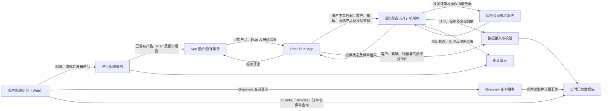

#### 链路说明

1. 保险公司人员在保险配置后台完成产品、Plan 和报价规则的配置、审批与发布。
2. 已发布配置通过 App 报价/投保服务提供给 RoadTrust App，App 据此展示可售产品并完成报价。
3. 用户在 App 确认投保后，客户、车辆、所选产品和投保资料先传入保险配置后台订单服务。
4. 保险配置后台完成基础校验和数据整理后，将投保订单及承保所需数据传给保险公司的核心系统。
5. 核心系统返回承保状态、保单及后续理赔结果；保险配置后台保存并同步结果，App 展示投保状态和保单信息。
6. App 驾驶数据和后台订单、保单数据实时写入运营数据库；进入 Overview 或修改筛选条件时，Overview 查询服务直接读取当前已提交数据并计算结果。

## 4. 角色定义与统一权限模型

### 4.1 角色定义

| 角色 | 数据范围 | 核心职责 | 默认限制 |
|---|---|---|---|
| Power Admin | 全平台；操作前必须选定目标租户 | 平台开发与运维支持、跨租户诊断、全局字典维护、应急解锁和受控发布 | 高危操作必须二次确认、填写原因并记录 break-glass 审计；不得绕过审计 |
| Admin | 当前保险公司租户 | 管理本公司用户、角色分配、数据访问范围和导出权限；查看所有本公司业务数据 | 不自动获得产品编辑、审批或发布权限 |
| Maker | 当前租户及分配的产品线 | 创建和编辑产品配置草稿、维护 Plans/Benefits/Add-ons、提交审批 | 不得审批、发布本人提交的版本；不得编辑已发布快照 |
| Approver | 当前租户及分配的产品线 | 审核差异、批准或驳回、定时发布、暂停或下架已发布配置 | 不直接编辑 Maker 草稿；不得审批本人创建或提交的版本 |
| User | 当前租户及分配的数据范围 | 登录并只读查看被授权的 Overview、Client、Vehicle 和产品信息 | 无新增、编辑、删除、审批、发布和敏感导出权限 |

### 4.2 组合角色与职责分离

- 一个用户可拥有多个角色，最终权限取并集，但仍受租户和资源范围约束。
- Admin 为用户分配 Maker 或 Approver 后，该用户才获得对应业务权限。
- 同一用户即使同时具备 Maker 和 Approver，也不能审批本人创建、最后编辑或提交的配置版本。
- 审批任务必须由后端根据 `submitted_by != current_user_id` 校验，不能只依赖前端禁用按钮。
- Power Admin 的紧急越权需要工单号或原因，操作进入独立高危审计队列。
- 默认拒绝：未显式授予的模块、动作、租户或产品线一律不可访问。

### 4.3 权限粒度

权限编码采用 `模块.资源.动作`，例如：

- `overview.dashboard.read`
- `client.profile.read_masked`
- `client.pii.read_clear`
- `client.export`
- `vehicle.list.read`
- `vehicle.export`
- `product.version.create`
- `product.version.submit`
- `product.version.approve`
- `product.version.publish`
- `product.version.suspend`

## 5. Overview 开发设计

### 5.1 页面目标

Overview 是登录后的默认页面，为保险公司提供本租户经营、客户、车辆和驾驶风险的一屏概览。页面只展示汇总信息，不在 Overview 直接修改客户、车辆、保单或产品配置。

### 5.2 页面整体布局

| 区域 | 位置 | 内容 | 主要交互 |
|---|---|---|---|
| 页面标题与筛选 | 内容区顶部 | Overview、统计周期、产品线、区域、本次查询时间 | 切换筛选、恢复默认条件；每次变更筛选后重新查询 |
| KPI 卡片 | 第一行 | App 客户数、30 日活跃客户数、在保车辆数、有效保单数、平均驾驶分、签单保费、未结理赔 | 仅展示，无点击交互 |
| 保费趋势 | 中部左侧 | Written Premium 与 Earned Premium 月度折线 | 切换时间粒度、悬浮查看数值 |
| 理赔趋势 | 中部右侧 | Filed、Settled、Denied 月度柱状或组合图 | 图例开关、悬浮查看数值 |
| 保障组合 | 下部左侧 | Comprehensive、Third Party、TP Fire & Theft、Fleet 等占比 | 仅展示，无点击交互 |
| 驾驶风险分布 | 下部中部 | 低、中、高、严重风险客户/车辆分布 | 仅展示，无点击交互 |

窄屏下 KPI 改为两列或单列，图表纵向排列，并保留指标标签和单位。

### 5.3 页面信息架构

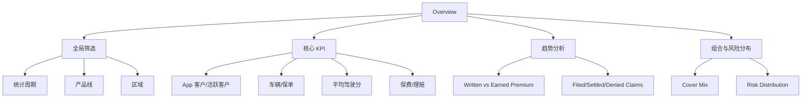

### 5.4 指标口径

所有指标在用户进入 Overview 或修改统计周期、产品线、区域等筛选条件时，通过查询服务读取数据库当前已提交的数据并实时计算。页面停留期间不自动轮询；下一次进入页面、修改筛选条件或错误重试时重新查询。

| 指标 | 口径 |
|---|---|
| App 客户数 | 当前租户中成功绑定 App 账号且未注销的去重客户数 |
| 30 日活跃客户数 | 以本次查询时间为基准，最近 30 个自然日内至少登录或上传一段有效行程的去重客户数 |
| 在保车辆数 | 本次查询时至少关联一张 `IN_FORCE` 保单的去重车辆数 |
| 有效保单数 | 本次查询时状态为 `IN_FORCE` 且处于生效区间内的保单数 |
| 平均驾驶分 | 具备有效最新评分客户的 `overall_score` 算术平均；无评分客户不进入分母 |
| 签单保费 | 所选周期内已签发保单的 written premium，按页面基准币种折算 |
| 未结理赔 | 本次查询时处于 `FILED/UNDER_REVIEW/APPROVED/IN_LITIGATION` 状态的理赔数 |
| Cover Mix | 本次查询时有效保单按 cover category 统计；默认按保单数占比 |
| 风险分布 | 每辆车取本次查询时最新有效的 vehicle risk score：0–39 低、40–59 中、60–79 高、80–100 严重 |

若租户存在多币种，页面必须显示基准币种和汇率日期；无法取得有效汇率的数据不得静默加入总额。

### 5.5 权限矩阵

| 操作 | Power Admin | Admin | Maker | Approver | User |
|---|---:|---:|---:|---:|---:|
| 查看本租户汇总指标 | 是 | 是 | 是 | 是 | 是 |
| 查看跨租户汇总 | 是，需选择租户 | 否 | 否 | 否 | 否 |
| 使用产品线/周期筛选 | 是 | 是 | 是 | 是 | 是 |
| 查看经营金额指标 | 是 | 是 | 可配置 | 可配置 | 默认否 |

### 5.6 状态流转图

Overview 无业务写状态，以下为页面数据加载与降级状态：

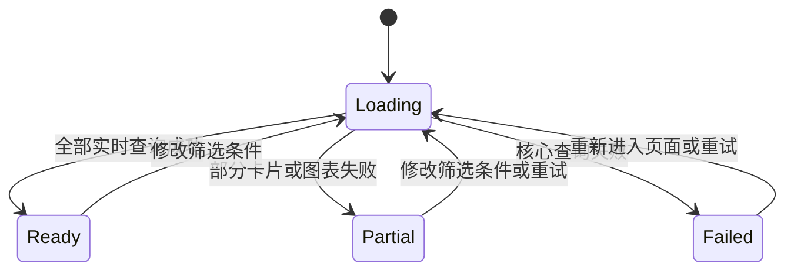

#### 状态说明

| 状态 | 含义 | 页面表现 |
|---|---|---|
| `Loading` | 用户进入 Overview、修改筛选条件或重试时，页面正在通过查询服务读取实时业务数据 | 显示数据加载占位界面；筛选切换时保留现有布局 |
| `Ready` | 所有 KPI 和图表的实时查询均成功 | 正常显示完整页面和本次查询时间 |
| `Partial` | 页面可以使用，但部分卡片或图表加载失败 | 成功部分正常显示；失败部分显示错误提示，不能用 `0` 代替 |
| `Failed` | Overview 核心查询失败，页面主要数据无法显示 | 显示加载失败和重试提示 |

页面进入 `Partial` 时必须在对应卡片显示错误原因，不得用 0 代替未知数据。页面停留期间不自动轮询；数据库发生变化后，用户下一次进入页面、修改筛选条件或重试时才能看到新结果。

### 5.7 数据库设计

Overview 不创建指标、趋势或分布快照表。查询服务在每次页面请求时，直接读取 Client、Vehicle、Policy、Driving Score、Vehicle Risk 和 Claim 等业务表的当前已提交数据，并按照第 5.4 节口径实时计算结果。

为避免同一次请求中的多个 KPI 因并发写入而采用不同时间点的数据，后端应在同一数据库一致性读取范围内完成该次查询，并返回统一的本次查询时间。数据库索引、只读视图或查询优化可以用于提升性能，但不得把每日批处理快照作为 Overview 的数据来源。

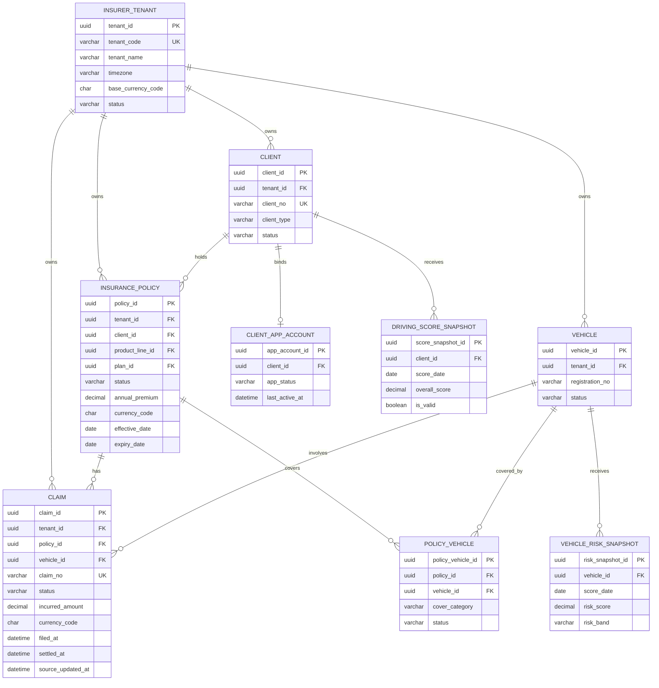

#### 5.7.1 `insurer_tenant` 数据字典

| 字段 | 类型 | 必填 | 约束/索引 | 说明 |
|---|---|---:|---|---|
| tenant_id | UUID | 是 | PK | 保险公司租户唯一 ID |
| tenant_code | VARCHAR(64) | 是 | UK | 不可重复的租户编码 |
| tenant_name | VARCHAR(128) | 是 |  | 租户展示名称 |
| timezone | VARCHAR(64) | 是 | 默认 `Asia/Hong_Kong` | IANA 时区名称 |
| base_currency_code | CHAR(3) | 是 | ISO 4217 | Overview 金额折算币种 |
| fiscal_year_start_month | TINYINT | 是 | 1–12 | 财年起始月份 |
| status | VARCHAR(20) | 是 | `ACTIVE/SUSPENDED/CLOSED` | 租户状态 |
| created_at | DATETIME | 是 |  | UTC 创建时间 |
| updated_at | DATETIME | 是 |  | UTC 更新时间 |

#### 5.7.2 实时查询数据来源

| Overview 数据 | 直接读取的业务表 | 实时查询规则 |
|---|---|---|
| App 客户数、30 日活跃客户数 | `client`、`client_app_account` | 按当前租户、账号状态和本次查询时间筛选并去重 |
| 在保车辆数、有效保单数、Cover Mix、签单保费 | `insurance_policy`、`policy_vehicle`、`vehicle` | 按本次查询时间判断保单生效区间及状态，并按产品线、区域等条件汇总 |
| 平均驾驶分 | `driving_score_snapshot` | 每个客户只取本次查询时最新且有效的评分记录后计算平均值 |
| 驾驶风险分布 | `vehicle_risk_snapshot` | 每辆车只取本次查询时最新有效风险记录，再按风险等级汇总 |
| 未结理赔和理赔趋势 | `claim` | 按理赔状态、发生时间和所选统计周期实时统计 |

`client`、`client_app_account`、`driving_score_snapshot` 和 `insurance_policy` 的数据字典见第 6 章；`vehicle`、`policy_vehicle` 和 `vehicle_risk_snapshot` 的数据字典见第 7 章。Overview 不复制这些业务数据。

#### 5.7.3 `claim` 数据字典

| 字段 | 类型 | 必填 | 约束/索引 | 说明 |
|---|---|---:|---|---|
| claim_id | UUID | 是 | PK | 理赔记录 ID |
| tenant_id | UUID | 是 | FK；索引 | 所属保险公司租户 ID |
| policy_id | UUID | 是 | FK；索引 | 关联保单 ID |
| vehicle_id | UUID | 否 | FK；索引 | 关联车辆 ID；非车辆级理赔时可为空 |
| claim_no | VARCHAR(64) | 是 | UK(`tenant_id`,`claim_no`) | 租户内唯一理赔编号 |
| status | VARCHAR(24) | 是 | 索引 | `FILED/UNDER_REVIEW/APPROVED/SETTLED/DENIED/IN_LITIGATION/CLOSED` |
| incurred_amount | DECIMAL(18,2) | 否 | ≥ 0 | 当前已发生理赔金额 |
| currency_code | CHAR(3) | 否 | ISO 4217 | 理赔金额币种 |
| filed_at | DATETIME | 是 | 索引 | 报案时间，UTC |
| settled_at | DATETIME | 否 | 索引 | 结案或赔付完成时间，UTC |
| source_updated_at | DATETIME | 是 | 索引 | 核心理赔系统最后更新时间，UTC |

`claim` 是保险公司核心理赔系统在本后台数据库中的实时只读投影。Overview 只查询该表，不在本页面创建或修改理赔记录。

### 5.8 异常与边界场景

| 场景 | 系统处理 |
|---|---|
| 新租户暂无数据 | 显示引导型空状态和数据接入状态，不显示全为 0 的“正常经营”假象 |
| 上游数据尚未写入实时数据库 | 已写入的数据正常展示；页面显示各数据源的最近同步时间，不把尚未到达的数据计算为 0 |
| 统计周期无数据 | 图表展示空坐标和“该周期暂无数据”，KPI 显示 `—` 或 0 取决于指标语义 |
| 多币种缺少汇率 | 排除无法换算金额并显示警告、受影响记录数和汇率日期 |
| 用户无金额权限 | 隐藏金额卡片及相关图表；接口不返回金额字段 |
| 实时汇总查询超时 | 已成功返回的卡片或图表继续展示，超时部分进入 `Partial` 并允许单独重试 |
| 直接访问无权限目标页面 | 后端返回 403，不返回目标页面数据 |
| 查询期间业务数据发生变化 | 同一次 Overview 请求使用统一的一致性读取时间；变更数据在下一次查询时体现 |
| 超大统计周期 | 服务端限制最大范围；自动切换月/季度粒度或提示缩小范围 |

### 5.9 验收要点

- 同一指标在不同筛选条件下的统计口径一致。
- 进入 Overview、修改筛选条件或错误重试时重新查询数据库当前已提交数据；页面停留期间不自动轮询。
- 同一次查询返回的 KPI、趋势和分布使用统一查询时间，不因并发写入产生相互矛盾的结果。
- 任一租户请求均不能返回其他租户的聚合或明细。
- 部分接口失败时，成功模块仍可使用且错误信息可定位。
- 图表具备文本标题、数值 Tooltip 和非颜色唯一编码，满足键盘与屏幕阅读器基本可访问性。
- 默认统计范围下，Overview 实时查询 P95 不高于 2 秒。

## 6. Clients 开发设计

### 6.1 页面目标与范围

Clients 用于保险公司查看已通过 App、投保或保险公司核心系统进入本租户数据域的客户。Figma 原型包含 Clients 列表以及从列表进入 Client Detail 的路由。

本期页面为只读运营查询，不允许保险公司在此直接修改 App 客户的身份、驾驶分或客户生命周期状态。身份纠错应通过源系统流程完成，同步后更新后台投影。

### 6.2 Clients 列表页面整体布局

| 区域 | 位置 | 内容 | 主要交互 |
|---|---|---|---|
| 标题区 | 顶部 | Clients、客户总数、本次查询时间 | 按权限导出 |
| 概览卡片 | 标题下方 | 总客户、App 已注册、30 日活跃、拥有在保车辆、无驾驶评分客户 | 点击卡片写入对应筛选条件 |
| 查询与筛选 | 表格上方 | 关键字、客户类型、App 状态、风险等级、保单状态、产品线 | 组合筛选、清空 |
| 客户表格 | 主区域 | 客户、类型、联系方式、App 状态、驾驶分、车辆数、有效保单、当前计划、最近活跃、状态 | 排序、分页、选择客户进入详情 |
| 分页区 | 表格底部 | 总条数、页码、每页数量 | 服务端分页 |

#### 6.2.1 列表字段

| 列 | 来源 | 展示规则 | 排序/筛选 |
|---|---|---|---|
| Client | `client.display_name/client_no` | 姓名或公司名；次行显示客户编号 | 关键字搜索；名称排序 |
| Type | `client.client_type` | Individual / Corporate | 可筛选 |
| Contact | `email_cipher/phone_cipher` | 默认脱敏，如 `l***@mail.com`、`+852 **** 1234` | 不支持模糊搜索明文 |
| App Status | `client_app_account.app_status` | Not Registered / Registered / Active / Suspended / Deactivated | 可筛选 |
| Driving Score | 最新 `driving_score_snapshot.overall_score` | 0–100；无数据展示 `—`；高分代表更安全 | 可排序；可按风险等级筛选 |
| Vehicles | 有效 `client_vehicle` 数量 | 非负整数 | 可排序 |
| Active Policies | `insurance_policy.status = IN_FORCE` 数量 | 非负整数 | 可排序/筛选 |
| Current Plan | 客户名下各在保车辆唯一有效保单的产品线和计划 | 按车辆分别展示对应 Plan；同一车辆不显示 `+N` | 可按产品线/计划筛选 |
| Last Active | App 最后登录或有效行程时间中的较晚值 | 按租户时区显示 | 可排序 |
| Client Status | `client.status` | Active / Suspended / Deactivated / Merged | 可筛选 |

### 6.3 Client Detail 页面整体布局

| 区域 | 位置 | 内容 | 主要交互 |
|---|---|---|---|
| 返回与标题 | 顶部 | 返回 Clients、客户编号、姓名/公司名、类型、状态 | 返回 Clients 列表 |
| 客户摘要 | 第一行 | App 状态、最新驾驶分、车辆数、有效保单数、年度保费、最近活跃 | 跳转到对应详情区块 |
| Profile | 主区块 | 基础资料、脱敏联系方式、App 注册信息、授权状态 | 有 PII 权限时临时查看明文；记录审计 |
| Driving Performance | 主区块 | 当前分数、风险等级、时间趋势、急加速/急刹车/超速/转弯/手机使用等子分 | 切换 30/90/365 天；查看评分解释 |
| Vehicles & Policies | 主区块 | 车辆、车牌、遥测状态、车辆风险分、保单号、产品线、Plan、保障类型、保单状态和续保日 | 跳转 Vehicles 或 Policies；无权限则不可点击 |
| Data & Consent | 辅助区块 | 数据来源、最近同步、同意状态、数据保留信息 | 仅授权角色查看；不在本页修改 |

### 6.4 页面信息架构

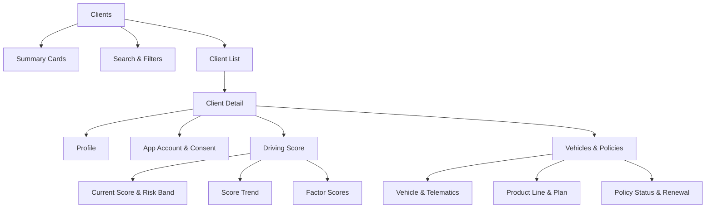

### 6.5 业务规则

1. 客户唯一性由租户内 `client_no` 保证；同一自然人可存在于不同租户，但数据不可跨租户合并。
2. `external_app_user_id` 仅作为 App 系统关联键，不在页面直接展示。
3. 驾驶分范围为 0–100，分数越高代表驾驶越安全；这与 Vehicles 中“风险分越高风险越大”的语义相反，页面必须明确标签。
4. 客户风险等级按最新有效驾驶分计算：80–100 Low、60–79 Medium、40–59 High、0–39 Critical；阈值必须可配置并带版本。
5. 最新驾驶分以 `score_date` 最大且 `is_valid = 1` 的记录为准；存在同日多版本时取 `calculated_at` 最新记录。
6. App 活跃客户指最近 30 天登录或上传有效行程；时间窗口由租户参数配置。
7. Corporate 客户可以关联多个驾驶人和多辆车；列表 Driving Score 默认显示有效驾驶人的加权平均，并在 Tooltip 中说明样本数。
8. 同一车辆同一时间最多关联一张状态为 `IN_FORCE` 的有效保单；客户有多辆在保车辆时，Current Plan 按车辆分别展示对应 Plan，不使用“主计划 +N”逻辑。
9. 客户被合并后，旧客户记录状态为 `MERGED` 并指向主客户；直接访问旧 ID 时跳转主客户并提示。
10. 所有联系方式、证件信息和 App 标识符均属于敏感数据；列表接口默认只返回脱敏值。

### 6.6 权限矩阵

| 操作 | Power Admin | Admin | Maker | Approver | User |
|---|---:|---:|---:|---:|---:|
| 查看本租户客户列表 | 是 | 是 | 是 | 是 | 是 |
| 查看客户详情 | 是 | 是 | 是 | 是 | 是 |
| 查看脱敏联系方式 | 是 | 是 | 是 | 是 | 是 |
| 查看明文 PII | 是，需说明原因 | 可配置，默认是 | 默认否 | 默认否 | 否 |
| 查看驾驶分与趋势 | 是 | 是 | 是 | 是 | 是 |
| 查看车辆与保单关联 | 是 | 是 | 是 | 是 | 是 |
| 导出客户数据 | 是 | 可配置，默认是 | 默认否 | 默认否 | 否 |
| 修改客户资料/分数/状态 | 否，本模块不提供 | 否 | 否 | 否 | 否 |
| 跨租户查询 | 是，需切换目标租户 | 否 | 否 | 否 | 否 |

### 6.7 状态流转图

客户状态来自 App 身份系统或客户主数据系统，本后台只读同步：

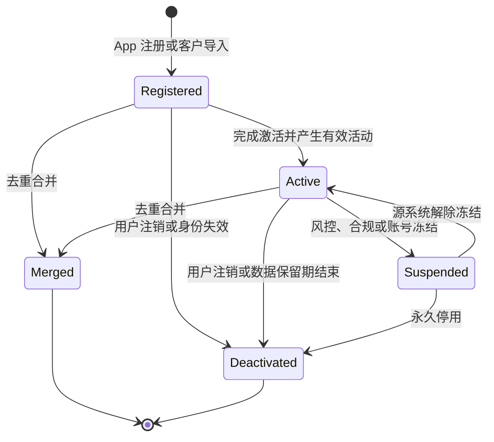

状态映射失败时保存源状态和错误码，后台展示 `UNKNOWN`，不得自行将其映射为 Active。

### 6.8 数据库设计

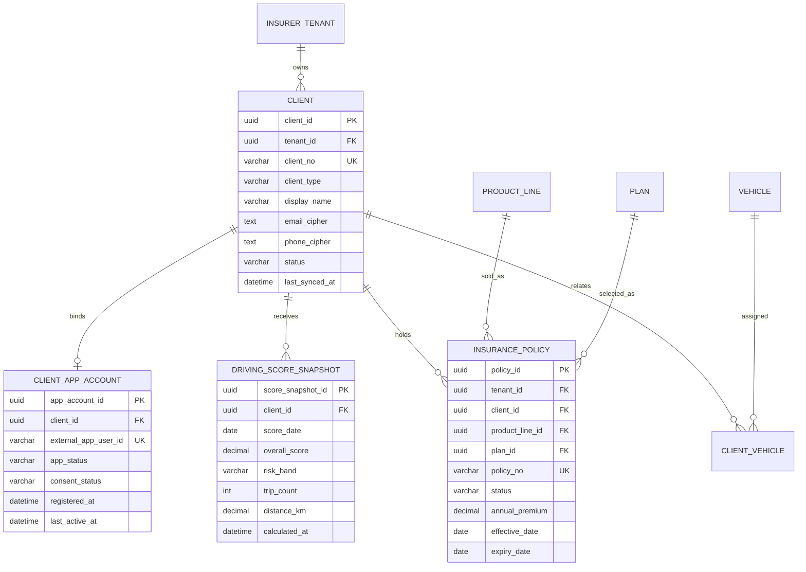

`CLIENT_VEHICLE` 与 `VEHICLE` 的完整数据字典见第 7 章，`PRODUCT_LINE` 与 `PLAN` 见第 8 章。

#### 6.8.1 `client` 数据字典

| 字段 | 类型 | 必填 | 约束/索引 | 说明 |
|---|---|---:|---|---|
| client_id | UUID | 是 | PK | 客户 ID |
| tenant_id | UUID | 是 | FK；所有唯一约束前缀 | 租户 ID |
| client_no | VARCHAR(64) | 是 | UK(`tenant_id`,`client_no`) | 租户内客户编号 |
| external_customer_ref | VARCHAR(128) | 否 | 索引 | 核心系统客户引用 |
| client_type | VARCHAR(16) | 是 | `INDIVIDUAL/CORPORATE` | 客户类型 |
| display_name | VARCHAR(256) | 是 | 索引 | 个人姓名或公司名称 |
| legal_name_cipher | TEXT | 否 | 加密 | 法定全名；需要时解密 |
| email_cipher | TEXT | 否 | 加密 | 邮箱密文 |
| email_masked | VARCHAR(256) | 否 |  | 可直接展示的脱敏邮箱 |
| phone_cipher | TEXT | 否 | 加密 | 电话密文 |
| phone_masked | VARCHAR(64) | 否 |  | 可直接展示的脱敏电话 |
| date_of_birth_cipher | TEXT | 否 | 加密 | 个人客户出生日期；公司客户为空 |
| region_code | VARCHAR(32) | 否 | 索引 | 客户所属区域 |
| status | VARCHAR(20) | 是 | 索引 | `REGISTERED/ACTIVE/SUSPENDED/DEACTIVATED/MERGED/UNKNOWN` |
| merged_into_client_id | UUID | 否 | FK | `MERGED` 时指向主客户 |
| source_system | VARCHAR(32) | 是 |  | `APP/CORE/CRM` |
| source_updated_at | DATETIME | 是 |  | 源系统更新时间 |
| last_synced_at | DATETIME | 是 | 索引 | 最近成功同步时间 |
| created_at | DATETIME | 是 |  | 创建时间 |
| updated_at | DATETIME | 是 |  | 更新时间 |
| row_version | INT UNSIGNED | 是 | 默认 1 | 乐观锁版本 |

#### 6.8.2 `client_app_account` 数据字典

| 字段 | 类型 | 必填 | 约束/索引 | 说明 |
|---|---|---:|---|---|
| app_account_id | UUID | 是 | PK | App 账号绑定 ID |
| tenant_id | UUID | 是 | FK；索引 | 租户 ID，便于强制数据隔离 |
| client_id | UUID | 是 | FK；UK | 每个客户的主 App 账号 |
| external_app_user_id | VARCHAR(128) | 是 | UK(`tenant_id`,`external_app_user_id`) | App 用户关联键，不在 UI 展示 |
| app_status | VARCHAR(20) | 是 | 索引 | `NOT_REGISTERED/REGISTERED/ACTIVE/SUSPENDED/DEACTIVATED` |
| consent_status | VARCHAR(20) | 是 |  | `PENDING/GRANTED/REVOKED/EXPIRED` |
| consent_version | VARCHAR(32) | 否 |  | 用户同意的条款版本 |
| consent_at | DATETIME | 否 |  | 同意时间 |
| registered_at | DATETIME | 否 |  | 注册时间 |
| last_login_at | DATETIME | 否 | 索引 | 最后登录时间 |
| last_trip_at | DATETIME | 否 | 索引 | 最后有效行程时间 |
| last_active_at | DATETIME | 否 | 索引 | `max(last_login_at,last_trip_at)` 的投影 |
| last_synced_at | DATETIME | 是 |  | 最近同步时间 |

#### 6.8.3 `driving_score_snapshot` 数据字典

| 字段 | 类型 | 必填 | 约束/索引 | 说明 |
|---|---|---:|---|---|
| score_snapshot_id | UUID | 是 | PK | 评分快照 ID |
| tenant_id | UUID | 是 | FK；索引 | 租户 ID |
| client_id | UUID | 是 | FK；索引 | 客户 ID |
| score_date | DATE | 是 | UK 组成列 | 评分日期 |
| score_window_days | SMALLINT | 是 | > 0 | 评分观察窗口天数 |
| overall_score | DECIMAL(5,2) | 是 | 0–100 | 驾驶安全分；越高越安全 |
| acceleration_score | DECIMAL(5,2) | 否 | 0–100 | 急加速维度得分 |
| braking_score | DECIMAL(5,2) | 否 | 0–100 | 急刹车维度得分 |
| speeding_score | DECIMAL(5,2) | 否 | 0–100 | 超速维度得分 |
| cornering_score | DECIMAL(5,2) | 否 | 0–100 | 急转弯维度得分 |
| phone_use_score | DECIMAL(5,2) | 否 | 0–100 | 驾驶中手机使用得分 |
| risk_band | VARCHAR(16) | 是 | 索引 | `LOW/MEDIUM/HIGH/CRITICAL` |
| trip_count | INT UNSIGNED | 是 | ≥ 0 | 有效行程数 |
| distance_km | DECIMAL(12,2) | 是 | ≥ 0 | 有效里程 |
| scoring_model_version | VARCHAR(32) | 是 |  | 评分模型版本 |
| is_valid | BOOLEAN | 是 | 默认 1 | 是否为有效计算结果 |
| invalid_reason | VARCHAR(256) | 否 |  | 失效原因 |
| calculated_at | DATETIME | 是 | 索引 | 计算时间 |

唯一约束：`tenant_id + client_id + score_date + score_window_days + scoring_model_version`。

#### 6.8.4 `insurance_policy` 数据字典

| 字段 | 类型 | 必填 | 约束/索引 | 说明 |
|---|---|---:|---|---|
| policy_id | UUID | 是 | PK | 保单 ID |
| tenant_id | UUID | 是 | FK；索引 | 租户 ID |
| policy_no | VARCHAR(64) | 是 | UK(`tenant_id`,`policy_no`) | 保单号 |
| external_policy_ref | VARCHAR(128) | 否 | 索引 | 核心保单系统引用 |
| client_id | UUID | 是 | FK；索引 | 投保客户 ID |
| product_line_id | UUID | 是 | FK；索引 | 产品线 ID |
| product_version_id | UUID | 是 | FK | 出单时冻结的产品版本 |
| plan_id | UUID | 是 | FK；索引 | 计划 ID |
| plan_version_id | UUID | 是 | FK | 出单时冻结的计划版本 |
| cover_category | VARCHAR(32) | 是 | 索引 | 保障类型快照 |
| status | VARCHAR(24) | 是 | 索引 | `PENDING/IN_FORCE/LAPSED/CANCELLED/EXPIRED` |
| annual_premium | DECIMAL(18,2) | 是 | ≥ 0 | 年保费 |
| currency_code | CHAR(3) | 是 | ISO 4217 | 币种 |
| effective_date | DATE | 是 | 索引 | 生效日 |
| expiry_date | DATE | 是 | 索引 | 到期日，必须不早于生效日 |
| renewal_date | DATE | 否 | 索引 | 续保处理日期 |
| source_updated_at | DATETIME | 是 |  | 源系统更新时间 |
| last_synced_at | DATETIME | 是 |  | 最近同步时间 |

### 6.9 异常与边界场景

| 场景 | 系统处理 |
|---|---|
| 客户不存在或不属于当前租户 | 统一返回 404，避免泄露跨租户对象是否存在 |
| 无客户查看权限 | 返回 403，响应中不包含任何客户字段 |
| App 账号未绑定 | App Status 显示 Not Registered，Driving Score 为空，不视为系统错误 |
| 驾驶样本不足 | 显示“Insufficient data”和有效行程/里程，不生成误导性分数 |
| 评分模型升级 | 趋势图标注模型版本切换点；不同版本不可无说明地直接比较 |
| Corporate 客户无驾驶人 | 平均分显示 `—`，不计入 Overview 平均分分母 |
| 客户有多辆车或多张保单 | 服务端分页/折叠；主保单规则一致；不得随机显示一条 |
| 数据同步冲突 | 按源系统版本和更新时间处理；冲突进入数据质量队列，不在后台直接覆盖 |
| PII 临时授权过期 | 清除明文并要求重新说明原因；不得缓存到浏览器持久存储 |
| 导出数据量过大 | 创建异步任务；限制最大时间范围和行数；文件加密并自动过期 |
| 客户已合并 | 旧 ID 返回主客户引用；UI 提示并跳转；关联车辆和保单不得丢失 |
| 联系方式为空 | 显示 `—`，不得填充测试值或复用其他客户信息 |
| 列表与详情查询时间不同 | 进入详情时重新查询当前数据，并分别显示本次查询时间；不得用列表页客户端缓存覆盖详情数据 |

### 6.10 验收要点

- 从列表进入详情再返回时，筛选、排序、页码和滚动位置保持不变。
- Driving Score 的“高分更安全”语义在列表、详情、筛选和导出中一致。
- 无 PII 权限的响应体不包含明文，不能仅依靠 CSS 隐藏。
- `client_id` 替换为其他租户 ID 时返回 404，且无时间侧信道暴露。
- 默认筛选和分页下，客户列表接口 P95 不高于 500 ms。

## 7. Vehicles 开发设计

### 7.1 页面目标与范围

Vehicles 用于保险公司集中查看已与本租户客户或保单建立关系的车辆。Figma 原型的 Vehicles 是列表页，核心示例字段为 Registration、Make、Model、Year、Insured、Cover、Telematics、Risk Score、Mileage 和 Last Seen。

本期不新增独立 Vehicle Detail 路由，也不在本页维护车型目录或遥测设备。车型维护属于 Underwriter Panel — Make & Model，设备激活/解绑由 App 或设备管理服务负责。

### 7.2 页面整体布局

| 区域 | 位置 | 内容 | 主要交互 |
|---|---|---|---|
| 标题区 | 顶部 | Vehicles、车辆总数、本次查询时间 | 按权限导出 |
| 概览卡片 | 标题下方 | 在保车辆、遥测 Active、遥测 Stale/Inactive、高/严重风险车辆 | 点击卡片应用筛选 |
| 搜索与筛选 | 表格上方 | 车牌/品牌/型号/客户搜索、承保状态、Cover、Telematics、风险等级、品牌、年份 | 组合筛选、清空 |
| 车辆表格 | 主区域 | 原型字段及保单/Plan 摘要 | 排序、分页、按权限跳转 Client 或 Policy |
| 分页区 | 底部 | 总条数、页码、每页数量 | 服务端分页 |

### 7.3 页面信息架构

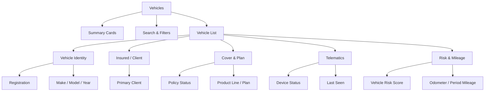

### 7.4 列表字段与展示规则

| 列 | 来源 | 展示规则 | 排序/筛选 |
|---|---|---|---|
| Registration | `vehicle.registration_no` | 原样展示标准化后的车牌；无牌车辆显示临时标识 | 关键字；升降序 |
| Make & Model | `vehicle.make_name_snapshot/model_name_snapshot` | 主行品牌型号，次行年份/车身类型 | 品牌、型号、年份筛选 |
| Insured | 有效主 `client_vehicle` + `client.display_name` | 个人或公司名；多使用人显示主客户 + `+N` | 关键字；可跳转 Client |
| Cover | 当前有效 `policy_vehicle.cover_category` | 如 Comprehensive、Third Party | 可筛选 |
| Product / Plan | `insurance_policy` | 如 RT-SOLO / Guard | 可按产品线、Plan 筛选 |
| Policy Status | `insurance_policy.status` | In Force / Pending / Lapsed / Expired / Cancelled | 可筛选 |
| Telematics | `telematics_device.status` | Active / Activating / Stale / Inactive / Fault / Unbound | 可筛选 |
| Risk Score | 最新 `vehicle_risk_snapshot.risk_score` | 0–100；分数越高风险越大；无数据为 `—` | 可排序和按风险等级筛选 |
| Mileage | 最新有效里程 | 显示千位分隔和 `km`；不混用 miles | 可排序 |
| Last Seen | 设备最后成功心跳或有效数据时间 | 相对时间 + Tooltip 绝对时间 | 可排序 |

### 7.5 业务规则

1. 租户内已标准化车牌唯一；标准化规则去除无意义空格并统一大小写，但展示值保留当地合法格式。
2. VIN 属于敏感车辆标识，不在列表展示；只保存加密值和不可逆查询哈希。
3. 一辆车可有多个客户关系，但同一时刻最多一个 `PRIMARY_INSURED`。
4. Fleet 保单可覆盖多辆车，因此保单与车辆采用多对多关联。
5. 当前 Cover/Plan 仅取当前时刻有效且状态为 `IN_FORCE` 的 `policy_vehicle`；同一车辆同一时间最多一条有效记录，页面直接展示该车辆唯一的当前 Cover 和 Plan。
6. Vehicle Risk Score 为风险分，0 最低风险、100 最高风险；风险段为 0–39 Low、40–59 Medium、60–79 High、80–100 Critical。
7. Telematics Active 表示设备已激活且最后数据时间未超过租户的陈旧阈值；默认阈值为 24 小时。
8. 已激活设备超过阈值未上报时，计算状态为 `STALE`；源状态仍保留，不直接改为 Inactive。
9. Mileage 使用设备最新可信里程。若出现倒退或异常跳变，保留上一可信值并进入数据质量告警。
10. Make/Model 使用车辆创建时的快照名展示，避免目录更名导致历史数据含义变化；同时保留目录外键用于筛选。

### 7.6 权限矩阵

| 操作 | Power Admin | Admin | Maker | Approver | User |
|---|---:|---:|---:|---:|---:|
| 查看本租户车辆列表 | 是 | 是 | 是 | 是 | 是 |
| 查看车主脱敏信息 | 是 | 是 | 是 | 是 | 是 |
| 跳转客户/保单 | 按目标权限 | 按目标权限 | 按目标权限 | 按目标权限 | 按目标权限 |
| 查看遥测状态与风险分 | 是 | 是 | 是 | 是 | 是 |
| 查看 VIN 明文 | 是，需说明原因 | 可配置，默认否 | 否 | 否 | 否 |
| 导出车辆列表 | 是 | 可配置，默认是 | 默认否 | 默认否 | 否 |
| 修改车辆/设备/风险分 | 否，本模块不提供 | 否 | 否 | 否 | 否 |
| 跨租户查询 | 是，需切换目标租户 | 否 | 否 | 否 | 否 |

### 7.7 状态流转图

Vehicles 页面主要关注遥测设备状态。状态由设备服务同步，本后台只读：

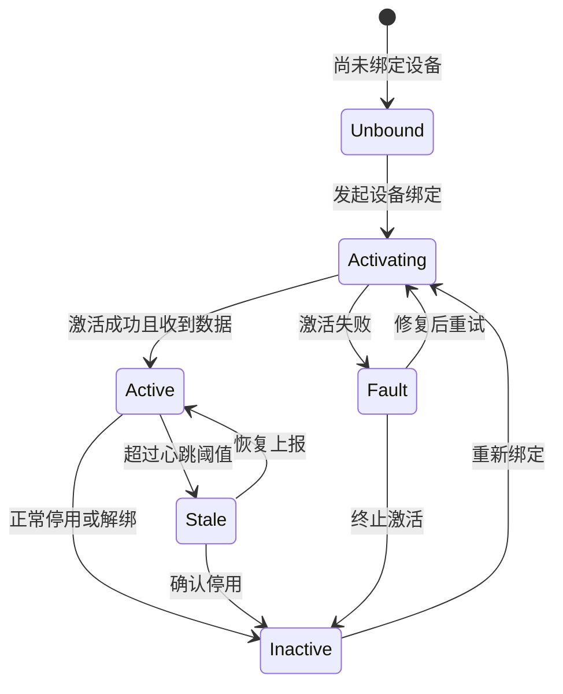

保单状态与设备状态相互独立：车辆可以在保但设备 Stale，也可以设备 Active 但当前无有效保单。页面不得将两者合并为一个“车辆状态”。

### 7.8 数据库设计

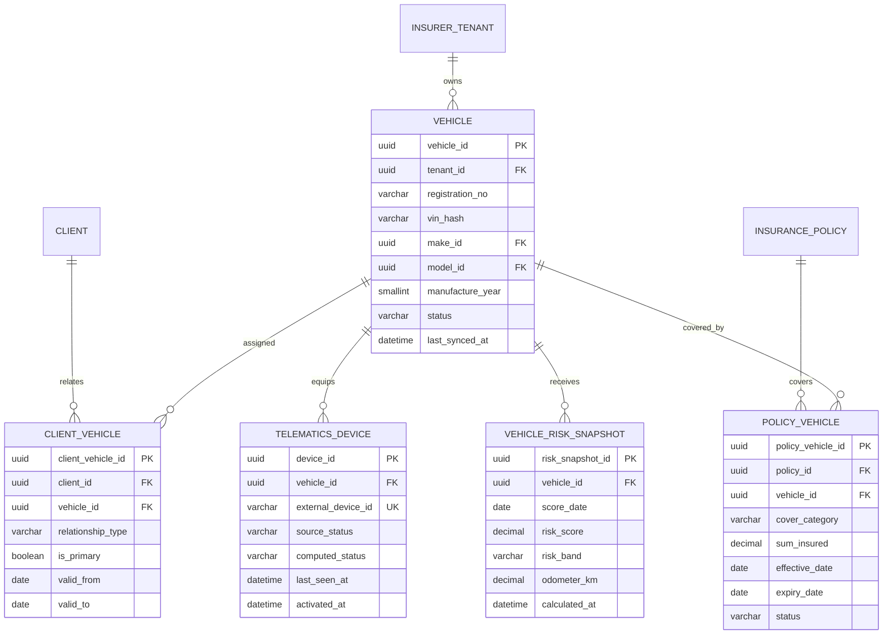

`CLIENT` 和 `INSURANCE_POLICY` 数据字典见第 6 章。

#### 7.8.1 `vehicle` 数据字典

| 字段 | 类型 | 必填 | 约束/索引 | 说明 |
|---|---|---:|---|---|
| vehicle_id | UUID | 是 | PK | 车辆 ID |
| tenant_id | UUID | 是 | FK；索引 | 租户 ID |
| registration_no | VARCHAR(32) | 否 | UK(`tenant_id`,`registration_no_normalized`) | 展示车牌；未上牌时可为空 |
| registration_no_normalized | VARCHAR(32) | 否 | 索引 | 用于唯一性和搜索的标准化车牌 |
| temporary_vehicle_ref | VARCHAR(64) | 否 | UK 组成列 | 未上牌车辆临时标识 |
| vin_cipher | TEXT | 否 | 加密 | VIN 密文 |
| vin_hash | VARCHAR(128) | 否 | UK(`tenant_id`,`vin_hash`) | VIN 查询哈希，不可逆展示 |
| make_id | UUID | 否 | FK；索引 | 车型目录品牌 ID |
| model_id | UUID | 否 | FK；索引 | 车型目录型号 ID |
| make_name_snapshot | VARCHAR(128) | 是 |  | 品牌展示快照 |
| model_name_snapshot | VARCHAR(128) | 是 |  | 型号展示快照 |
| manufacture_year | SMALLINT | 是 | 1886–当前年+1 | 生产/款式年份 |
| body_type | VARCHAR(32) | 否 |  | Sedan、SUV、Hatchback 等 |
| engine_cc | INT UNSIGNED | 否 | ≥ 0 | 发动机排量；纯电可为 0 |
| fuel_type | VARCHAR(24) | 否 |  | `PETROL/DIESEL/HYBRID/EV/OTHER` |
| seat_count | SMALLINT | 否 | > 0 | 座位数 |
| status | VARCHAR(20) | 是 | 索引 | `ACTIVE/INACTIVE/SOLD/SCRAPPED/UNKNOWN` |
| source_system | VARCHAR(32) | 是 |  | 车辆权威来源 |
| source_updated_at | DATETIME | 是 |  | 源更新时间 |
| last_synced_at | DATETIME | 是 | 索引 | 最近同步时间 |
| created_at | DATETIME | 是 |  | 创建时间 |
| updated_at | DATETIME | 是 |  | 更新时间 |
| row_version | INT UNSIGNED | 是 | 默认 1 | 乐观锁版本 |

约束：`registration_no_normalized` 和 `temporary_vehicle_ref` 至少一个有值。

#### 7.8.2 `client_vehicle` 数据字典

| 字段 | 类型 | 必填 | 约束/索引 | 说明 |
|---|---|---:|---|---|
| client_vehicle_id | UUID | 是 | PK | 客户车辆关系 ID |
| tenant_id | UUID | 是 | FK；索引 | 租户 ID |
| client_id | UUID | 是 | FK；联合索引 | 客户 ID |
| vehicle_id | UUID | 是 | FK；联合索引 | 车辆 ID |
| relationship_type | VARCHAR(24) | 是 |  | `PRIMARY_INSURED/OWNER/DRIVER/FLEET_MANAGER` |
| is_primary | BOOLEAN | 是 | 默认 0 | 是否为页面主展示关系 |
| valid_from | DATE | 是 |  | 关系生效日 |
| valid_to | DATE | 否 |  | 空表示当前有效；不得早于 `valid_from` |
| status | VARCHAR(16) | 是 | 索引 | `ACTIVE/ENDED` |
| source_system | VARCHAR(32) | 是 |  | 关系来源 |
| created_at | DATETIME | 是 |  | 创建时间 |
| updated_at | DATETIME | 是 |  | 更新时间 |

同一车辆在日期重叠区间内只能存在一个有效的 `PRIMARY_INSURED`。

#### 7.8.3 `telematics_device` 数据字典

| 字段 | 类型 | 必填 | 约束/索引 | 说明 |
|---|---|---:|---|---|
| device_id | UUID | 是 | PK | 设备绑定 ID |
| tenant_id | UUID | 是 | FK；索引 | 租户 ID |
| vehicle_id | UUID | 是 | FK；索引 | 车辆 ID |
| external_device_id | VARCHAR(128) | 是 | UK(`tenant_id`,`external_device_id`) | 设备平台标识 |
| provider_code | VARCHAR(64) | 是 |  | 设备/数据供应商 |
| source_status | VARCHAR(24) | 是 |  | 源系统状态原值 |
| computed_status | VARCHAR(24) | 是 | 索引 | `UNBOUND/ACTIVATING/ACTIVE/STALE/INACTIVE/FAULT` |
| firmware_version | VARCHAR(64) | 否 |  | 固件版本 |
| activated_at | DATETIME | 否 |  | 激活时间 |
| deactivated_at | DATETIME | 否 |  | 停用时间 |
| last_seen_at | DATETIME | 否 | 索引 | 最后成功上报时间 |
| last_error_code | VARCHAR(64) | 否 |  | 最近设备错误码 |
| stale_threshold_minutes | INT UNSIGNED | 是 | 默认 1440 | 陈旧判定阈值 |
| last_synced_at | DATETIME | 是 |  | 最近同步时间 |

#### 7.8.4 `vehicle_risk_snapshot` 数据字典

| 字段 | 类型 | 必填 | 约束/索引 | 说明 |
|---|---|---:|---|---|
| risk_snapshot_id | UUID | 是 | PK | 车辆风险快照 ID |
| tenant_id | UUID | 是 | FK；索引 | 租户 ID |
| vehicle_id | UUID | 是 | FK；索引 | 车辆 ID |
| score_date | DATE | 是 | UK 组成列 | 风险评分日期 |
| score_window_days | SMALLINT | 是 | > 0 | 观察窗口 |
| risk_score | DECIMAL(5,2) | 否 | 0–100 | 风险分；越高风险越大 |
| risk_band | VARCHAR(16) | 否 | 索引 | `LOW/MEDIUM/HIGH/CRITICAL` |
| odometer_km | DECIMAL(14,2) | 否 | ≥ 0 | 最新可信累计里程 |
| period_distance_km | DECIMAL(12,2) | 否 | ≥ 0 | 窗口内行驶里程 |
| harsh_braking_count | INT UNSIGNED | 否 | ≥ 0 | 急刹车次数 |
| harsh_acceleration_count | INT UNSIGNED | 否 | ≥ 0 | 急加速次数 |
| speeding_duration_sec | INT UNSIGNED | 否 | ≥ 0 | 超速持续秒数 |
| data_quality_status | VARCHAR(20) | 是 |  | `VALID/INSUFFICIENT/ANOMALOUS` |
| scoring_model_version | VARCHAR(32) | 是 |  | 车辆风险模型版本 |
| calculated_at | DATETIME | 是 | 索引 | 计算时间 |

#### 7.8.5 `policy_vehicle` 数据字典

| 字段 | 类型 | 必填 | 约束/索引 | 说明 |
|---|---|---:|---|---|
| policy_vehicle_id | UUID | 是 | PK | 保单车辆关系 ID |
| tenant_id | UUID | 是 | FK；索引 | 租户 ID |
| policy_id | UUID | 是 | FK；联合索引 | 保单 ID |
| vehicle_id | UUID | 是 | FK；联合索引 | 车辆 ID |
| cover_category | VARCHAR(32) | 是 | 索引 | 该车适用的保障类别 |
| sum_insured | DECIMAL(18,2) | 否 | ≥ 0 | 保险金额 |
| standard_excess | DECIMAL(18,2) | 否 | ≥ 0 | 标准免赔额快照 |
| currency_code | CHAR(3) | 否 | ISO 4217 | 金额字段币种 |
| effective_date | DATE | 是 | 索引 | 车辆保障起始日 |
| expiry_date | DATE | 是 | 索引 | 车辆保障终止日 |
| status | VARCHAR(20) | 是 | 索引 | `PENDING/IN_FORCE/LAPSED/CANCELLED/EXPIRED` |
| created_at | DATETIME | 是 |  | 创建时间 |
| updated_at | DATETIME | 是 |  | 更新时间 |

唯一约束：`tenant_id + policy_id + vehicle_id`。

有效期约束：同一 `tenant_id + vehicle_id` 下，状态为 `IN_FORCE` 的保障记录生效区间不得重叠；写入或同步发现冲突时必须拒绝进入正常展示数据，并记录数据质量异常。

### 7.9 异常与边界场景

| 场景 | 系统处理 |
|---|---|
| 车辆不存在或跨租户 | 返回 404，不泄露对象存在性 |
| 临时车辆无车牌 | 显示临时标识；不因车牌为空排除车辆 |
| 同一车牌重复同步 | 根据 VIN 哈希、源系统 ID 和人工数据质量流程处理；不得自动覆盖 |
| 车型目录已停用 | 历史车辆继续显示快照名称，并标记目录状态 |
| 无设备绑定 | Telematics 显示 Unbound；Last Seen 为 `—` |
| 设备状态 Active 但数据超时 | 页面计算为 Stale，同时保留源状态并产生遥测告警 |
| 风险样本不足 | Risk Score 显示 `—` 和 Insufficient data，不默认归入 Low |
| 里程倒退或异常跳变 | 保留上一可信值；标记数据质量异常；该异常值不纳入 Overview 汇总 |
| 同一车辆出现多张生效期重叠的有效保单 | 视为数据质量冲突，不选择其中一张展示；保留最近一次可信数据并进入异常处理流程 |
| Fleet 保单大量车辆 | 使用服务端分页和批量查询，禁止 N+1 查询 |
| 车主关系时间重叠 | 数据入库拒绝第二个主被保险人，记录冲突事件 |
| 无目标模块权限 | Insured 或 Policy 以不可点击文本显示 |
| 导出进行中重复提交 | 返回现有任务 ID，避免生成重复文件 |

### 7.10 验收要点

- Figma 原型中的十类核心字段均有明确数据来源、空值规则和排序/筛选行为。
- 驾驶安全分与车辆风险分的方向相反，但标签、颜色、Tooltip 和导出语义均正确。
- 设备超过阈值后自动展示 Stale，恢复上报后回到 Active。
- Fleet 保单关联大量车辆时无逐行请求和明显性能退化。
- 默认筛选和分页下，Vehicles 列表接口 P95 不高于 500 ms。

## 8. Underwriter Panel — Products & Plans 开发设计

### 8.1 页面目标与范围

Products & Plans 用于保险公司定义可在 RoadTrust App 报价和购买的车险产品。页面覆盖产品线选择、Plan 层级配置、保障与附加项组合、版本审批和发布状态。

Figma 原型及本地草稿展示的示例产品编码包括 RT-SOLO、RT-FLEET、RT-EV、RT-PRESTIGE，示例 Plan 层级包括 Starter、Guard、Elite、Apex。这些值为演示数据，生产环境由各租户配置。

### 8.2 页面整体布局

| 区域 | 位置 | 内容 | 主要交互 |
|---|---|---|---|
| 页面标题与版本操作 | 顶部 | Products & Plans、当前版本/状态、变更摘要、保存、提交审批、审批、发布 | 按角色和状态展示动作；高危动作二次确认 |
| 产品线卡片区 | 页面上方 | 产品线编码、名称、业务类型、状态、Plan 数量、当前发布版本 | 切换当前产品线；按状态筛选；进入产品线版本记录 |
| Plan 列表区 | 左侧主区 | Add Plan、Plan 卡片、等级、保障类别、基础倍数、标准免赔额、启停状态 | 选择、创建、复制、排序 Plan；草稿状态允许编辑 |
| Plan 详情区 | 右侧主区 | 基础信息、Included Benefits、Optional Add-ons、等级晋升关系 | 查看或编辑当前 Plan；配置依赖与互斥关系 |
| 审批差异区 | 审批模式右侧或抽屉 | 基准版本与提交版本差异、校验结果、Maker 信息、变更摘要 | Approve、Reject、填写审批意见 |
| 版本记录区 | 抽屉/独立 Tab | 版本号、状态、创建/提交/审批/发布时间、操作者 | 查看历史只读快照；基于历史版本新建草稿 |

### 8.3 页面信息架构

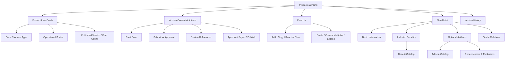

### 8.4 页面模式

| 模式 | 进入条件 | 可用操作 |
|---|---|---|
| Published Read-only | 默认打开已有产品线 | 查看当前生效版本；Maker 可创建新草稿 |
| Draft Edit | 当前用户有 Maker 权限且存在可编辑草稿 | 编辑、保存、校验、放弃草稿、提交审批 |
| Approval Review | 当前版本为 Pending Approval 且用户有 Approver 权限 | 查看差异、校验、批准、驳回；不可直接编辑 |
| Scheduled Read-only | 已批准并设定未来生效时间 | 查看、取消定时发布；变更需生成新草稿 |
| Historical Read-only | 从版本记录进入 | 查看版本快照、差异；基于此版本创建新草稿 |
| Suspended | 产品线被暂停 | 查看、恢复或创建整改版本；App 不再接受新报价/投保 |

### 8.5 字段与配置规则

#### 8.5.1 产品线卡片

| 字段 | 规则 |
|---|---|
| Product Line Code | 租户内唯一，创建后不可修改；建议大写字母、数字、短横线和下划线，1–64 字符 |
| Product Line Name | 1–128 字符；作为后台和渠道默认展示名 |
| Business Type | 如 Personal、Fleet Commercial、Electric Vehicle、Prestige；关联字典 |
| Operational Status | Active、Suspended、Retired；与配置版本状态分开显示 |
| Current Version | 当前已发布并在生效区间内的版本号 |
| Plan Count | 当前选择版本中未退休的 Plan 数量 |
| Sales Switch | 是否允许 App 新报价/新投保；只有 Active 且存在 Live 版本时可开启 |

#### 8.5.2 Plan 基础信息

| 字段 | 规则 |
|---|---|
| Plan Code | 产品线内唯一，稳定标识；创建后不可修改 |
| Plan Name | 1–128 字符；同一产品版本内不重复 |
| Grade Code / Order | 如 Starter/Guard/Elite/Apex；等级顺序必须唯一且连续或可排序 |
| Cover Category | Third Party Only、TP Fire & Theft、Comprehensive、Comprehensive+ 等 |
| Base Multiplier | 大于 0 的小数；默认 1.0000；只用于计算链路中已定义的乘数节点 |
| Standard Excess | 大于等于 0；币种必须与产品版本一致 |
| Enabled | 控制该 Plan 是否进入 App 可售集合；不影响历史保单 |
| Display Order | App 与后台默认顺序；同版本内不重复 |

#### 8.5.3 Included Benefits

- 从当前租户有效 Benefit Catalog 选择。
- 同一 Plan Version 不得重复添加同一 Benefit。
- 可配置保额、次数、免赔额、等待期和展示顺序；字段是否必填由 Benefit 类型决定。
- 已停用 Benefit 不可新增，但历史已发布版本继续展示快照。
- 发布前至少存在一个有效 Included Benefit；纯 Third Party 产品可使用专门的第三者责任 Benefit。

#### 8.5.4 Optional Add-ons

- Add-on 必须处于 Active 状态且适用于当前产品业务类型。
- 可配置加价规则编码、资格规则、依赖项、互斥项、上下架状态和展示顺序。
- 依赖关系必须无环；选择某 Add-on 时，其必选依赖必须同时满足。
- 同一对 Add-on 不得同时配置为依赖与互斥。
- 价格规则只保存稳定 `pricing_rule_code` 和版本引用，不复制动态价格结果。

#### 8.5.5 Plan 等级关系

- 同一产品版本内使用有向边表达可升级关系。
- 不允许自环和循环；每个 Plan 的 `grade_order` 唯一。
- 默认仅允许从低等级指向高等级；若允许降级，需显式标记 `relation_type = DOWNGRADE`。
- 被设为 App 推荐升级的边只能有一个同源默认目标。

### 8.6 Maker–Approver 业务规则

1. 首次创建产品线时，同时创建版本 `v1` 草稿；产品线尚无 Live 版本时不得对 App 开启销售。
2. 一个产品线同一时刻最多存在一个普通编辑草稿，避免平行修改难以合并；Power Admin 可在应急流程创建隔离修复草稿。
3. Maker 保存草稿时执行字段级校验；提交审批时执行完整发布前校验。
4. 提交后版本内容冻结。需要修改时由 Approver 驳回，或由提交人撤回至 Draft；所有动作记录原因。
5. Approver 只能批准或驳回，不能直接修改提交内容。
6. Maker 不能审批本人创建、最后编辑或提交的版本，即使同时拥有 Approver 角色。
7. 审批通过后可立即发布或设定未来生效时间。生效时间必须晚于当前时间和任何要求的最短通知期。
8. 发布使用不可变快照；修改 Live 产品必须从指定版本创建新草稿。
9. 新版本生效后，旧 Live 版本进入 Superseded；历史保单继续引用出单时版本。
10. 暂停销售不等于删除：停止新报价和新投保，但不影响已生效保单的查询、续期处理或理赔。
11. 删除仅允许未提交、未被引用的草稿对象，并使用软删除；已审批、已发布或已被保单/报价引用的对象不得删除。
12. 发布事务必须原子化：版本状态、产品当前版本指针、渠道缓存失效和发布事件使用事务 + Outbox 保证最终一致。

### 8.7 权限矩阵

| 操作 | Power Admin | Admin | Maker | Approver | User |
|---|---:|---:|---:|---:|---:|
| 查看产品线、Plan 和历史版本 | 是 | 是 | 是 | 是 | 是 |
| 查看完整变更差异与审计 | 是 | 是 | 是 | 是 | 默认否 |
| 创建产品线 | 是 | 仅叠加 Maker 后 | 是 | 仅叠加 Maker 后 | 否 |
| 创建/复制配置草稿 | 是 | 仅叠加 Maker 后 | 是 | 仅叠加 Maker 后 | 否 |
| 编辑 Plan/Benefit/Add-on | 是 | 仅叠加 Maker 后 | 是 | 仅叠加 Maker 后 | 否 |
| 保存/放弃草稿 | 是 | 仅叠加 Maker 后 | 是 | 仅叠加 Maker 后 | 否 |
| 提交/撤回审批 | 是 | 仅叠加 Maker 后 | 是 | 仅叠加 Maker 后 | 否 |
| 批准/驳回 | 是，需高危审计 | 仅叠加 Approver 后 | 仅叠加 Approver 且非本人 | 是，且非本人 | 否 |
| 立即/定时发布 | 是 | 仅叠加 Approver 后 | 仅叠加 Approver 且非本人 | 是 | 否 |
| 取消定时发布 | 是 | 仅叠加 Approver 后 | 否 | 是 | 否 |
| 暂停/恢复销售 | 是 | 仅叠加 Approver 后 | 否 | 是 | 否 |
| 删除未引用草稿 | 是 | 仅叠加 Maker 后 | 是 | 否 | 否 |
| 导出配置与差异 | 是 | 是 | 是 | 是 | 否 |

“仅叠加角色后”表示 Admin 本身没有该权限，必须额外分配相应角色和产品线资源范围。

### 8.8 状态流转图

#### 8.8.1 产品配置版本状态

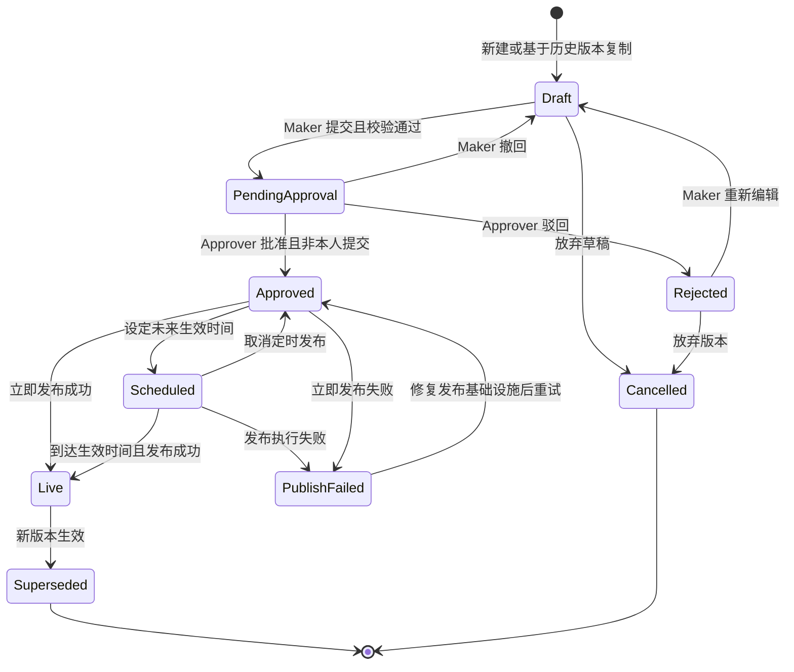

#### 8.8.2 产品线运营状态

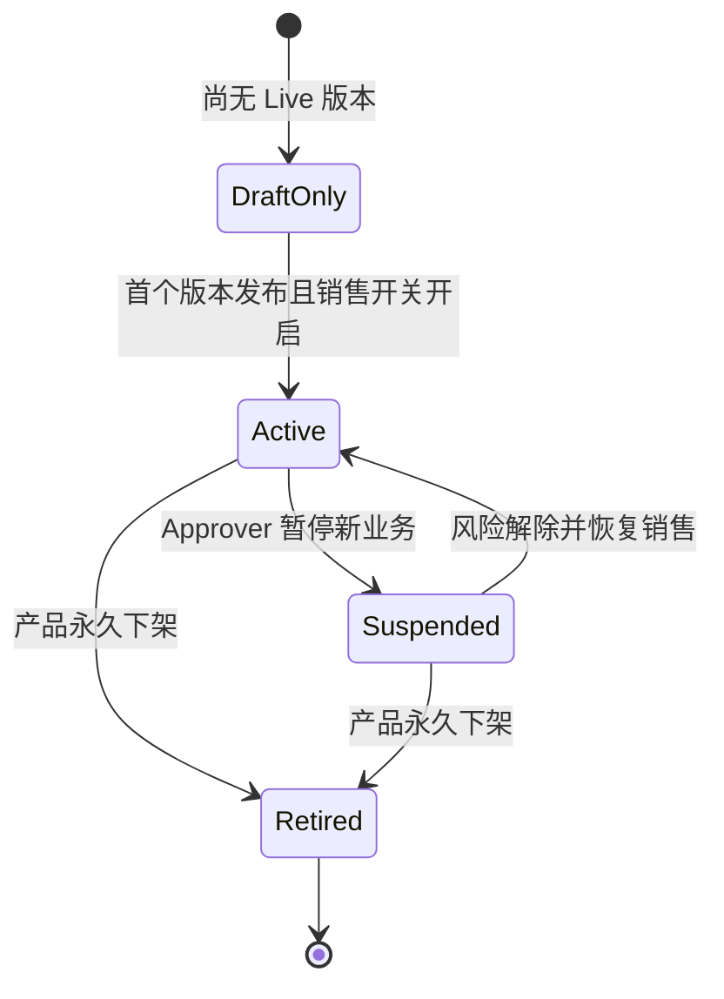

Retired 默认不可恢复。如确需恢复，应创建新产品线或由 Power Admin 通过受控数据修复流程处理。

### 8.9 数据库设计

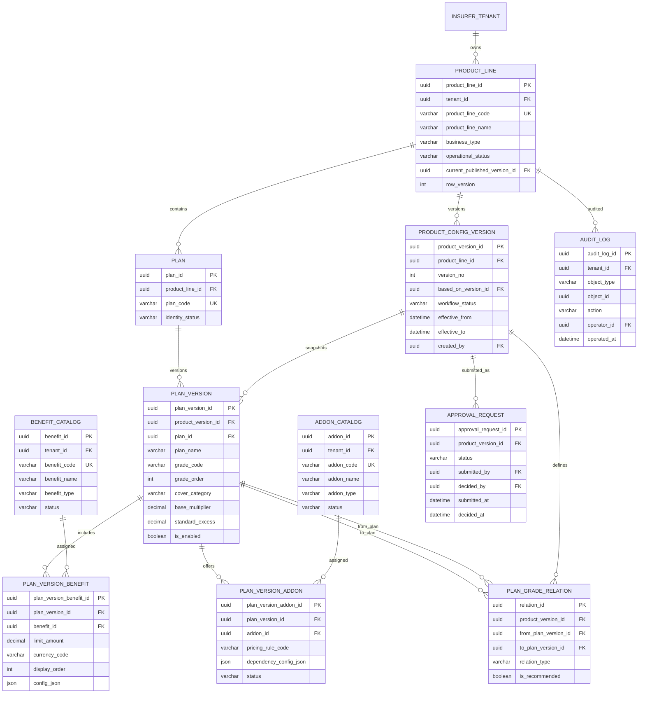

#### 8.9.1 `product_line` 数据字典

| 字段 | 类型 | 必填 | 约束/索引 | 说明 |
|---|---|---:|---|---|
| product_line_id | UUID | 是 | PK | 产品线稳定 ID |
| tenant_id | UUID | 是 | FK；所有唯一约束前缀 | 租户 ID |
| product_line_code | VARCHAR(64) | 是 | UK(`tenant_id`,`product_line_code`) | 产品线编码；创建后不可修改 |
| product_line_name | VARCHAR(128) | 是 | 索引 | 当前展示名称 |
| product_line_short_name | VARCHAR(64) | 否 |  | 卡片/App 短名称 |
| description | TEXT | 否 |  | 产品定位说明，不存完整条款 |
| business_type | VARCHAR(32) | 是 | 索引 | `PERSONAL/FLEET_COMMERCIAL/EV/PRESTIGE/OTHER` |
| insurance_type_code | VARCHAR(32) | 是 |  | 默认 `MOTOR_INSURANCE` |
| default_currency_code | CHAR(3) | 是 | ISO 4217 | 产品默认币种 |
| region_code | VARCHAR(32) | 否 | 索引 | 默认适用区域 |
| operational_status | VARCHAR(20) | 是 | 索引 | `DRAFT_ONLY/ACTIVE/SUSPENDED/RETIRED` |
| quote_enabled | BOOLEAN | 是 | 默认 0 | 是否允许新报价 |
| application_enabled | BOOLEAN | 是 | 默认 0 | 是否允许新投保 |
| current_published_version_id | UUID | 否 | FK | 当前生效版本 |
| display_order | INT UNSIGNED | 是 | 默认 0 | 产品线卡片顺序 |
| created_by | UUID | 是 | FK | 创建人 |
| created_at | DATETIME | 是 |  | 创建时间 |
| updated_by | UUID | 是 | FK | 最后更新人 |
| updated_at | DATETIME | 是 |  | 更新时间 |
| row_version | INT UNSIGNED | 是 | 默认 1 | 乐观锁版本 |
| is_deleted | BOOLEAN | 是 | 默认 0 | 软删除标志 |
| deleted_at | DATETIME | 否 |  | 软删除时间 |
| deleted_by | UUID | 否 | FK | 软删除人 |

#### 8.9.2 `product_config_version` 数据字典

| 字段 | 类型 | 必填 | 约束/索引 | 说明 |
|---|---|---:|---|---|
| product_version_id | UUID | 是 | PK | 产品配置版本 ID |
| tenant_id | UUID | 是 | FK；索引 | 租户 ID |
| product_line_id | UUID | 是 | FK；索引 | 产品线 ID |
| version_no | INT UNSIGNED | 是 | UK(`product_line_id`,`version_no`) | 单调递增版本号 |
| version_label | VARCHAR(32) | 是 |  | 展示版本，如 `v1.2` |
| based_on_version_id | UUID | 否 | 自关联 FK | 克隆来源版本 |
| workflow_status | VARCHAR(24) | 是 | 索引 | `DRAFT/PENDING_APPROVAL/REJECTED/APPROVED/SCHEDULED/LIVE/PUBLISH_FAILED/SUPERSEDED/CANCELLED` |
| change_summary | VARCHAR(1000) | 否 | 提交时必填 | 变更摘要 |
| validation_status | VARCHAR(16) | 是 |  | `NOT_RUN/PASSED/FAILED` |
| validation_result_json | JSON | 否 |  | 发布前校验结果 |
| effective_from | DATETIME | 否 | 索引 | 生效时间 |
| effective_to | DATETIME | 否 |  | 失效时间；空表示长期 |
| created_by | UUID | 是 | FK | 创建人 |
| created_at | DATETIME | 是 |  | 创建时间 |
| last_edited_by | UUID | 是 | FK | 最后编辑人；用于职责分离 |
| updated_at | DATETIME | 是 |  | 更新时间 |
| submitted_by | UUID | 否 | FK | 提交人 |
| submitted_at | DATETIME | 否 |  | 提交时间 |
| approved_by | UUID | 否 | FK | 批准人 |
| approved_at | DATETIME | 否 |  | 批准时间 |
| published_by | UUID | 否 | FK | 发布人或调度身份 |
| published_at | DATETIME | 否 |  | 实际发布时间 |
| row_version | INT UNSIGNED | 是 | 默认 1 | 草稿并发控制 |

#### 8.9.3 `plan` 数据字典

| 字段 | 类型 | 必填 | 约束/索引 | 说明 |
|---|---|---:|---|---|
| plan_id | UUID | 是 | PK | Plan 稳定身份 ID |
| tenant_id | UUID | 是 | FK；索引 | 租户 ID |
| product_line_id | UUID | 是 | FK；索引 | 所属产品线 |
| plan_code | VARCHAR(64) | 是 | UK(`product_line_id`,`plan_code`) | Plan 编码；创建后不可修改 |
| identity_status | VARCHAR(16) | 是 | 索引 | `ACTIVE/RETIRED` |
| created_by | UUID | 是 | FK | 创建人 |
| created_at | DATETIME | 是 |  | 创建时间 |
| retired_by | UUID | 否 | FK | 退休操作人 |
| retired_at | DATETIME | 否 |  | 退休时间 |

#### 8.9.4 `plan_version` 数据字典

| 字段 | 类型 | 必填 | 约束/索引 | 说明 |
|---|---|---:|---|---|
| plan_version_id | UUID | 是 | PK | Plan 版本快照 ID |
| tenant_id | UUID | 是 | FK；索引 | 租户 ID |
| product_version_id | UUID | 是 | FK；联合索引 | 产品配置版本 |
| plan_id | UUID | 是 | FK；联合索引 | Plan 稳定 ID |
| plan_name | VARCHAR(128) | 是 | UK(`product_version_id`,`plan_name`) | 展示名称 |
| grade_code | VARCHAR(32) | 是 |  | 等级编码 |
| grade_order | INT UNSIGNED | 是 | UK(`product_version_id`,`grade_order`) | 等级顺序 |
| cover_category | VARCHAR(32) | 是 | 索引 | 保障类别 |
| base_multiplier | DECIMAL(8,4) | 是 | > 0 | 基础倍数 |
| standard_excess | DECIMAL(18,2) | 是 | ≥ 0 | 标准免赔额 |
| currency_code | CHAR(3) | 是 | ISO 4217 | 免赔额币种 |
| is_enabled | BOOLEAN | 是 | 默认 0 | 该版本中是否可售 |
| display_order | INT UNSIGNED | 是 |  | App/后台展示顺序 |
| marketing_description | VARCHAR(1000) | 否 |  | 渠道展示说明 |
| config_json | JSON | 否 | Schema 校验 | 少量可扩展配置，不替代核心列 |
| created_at | DATETIME | 是 |  | 快照创建时间 |
| updated_at | DATETIME | 是 |  | 草稿更新时间 |

唯一约束：`product_version_id + plan_id`。

#### 8.9.5 `benefit_catalog` 数据字典

| 字段 | 类型 | 必填 | 约束/索引 | 说明 |
|---|---|---:|---|---|
| benefit_id | UUID | 是 | PK | Benefit ID |
| tenant_id | UUID | 是 | FK；索引 | 租户 ID |
| benefit_code | VARCHAR(64) | 是 | UK(`tenant_id`,`benefit_code`) | 稳定编码 |
| benefit_name | VARCHAR(128) | 是 | 索引 | 名称 |
| benefit_type | VARCHAR(32) | 是 |  | `LIABILITY/OWN_DAMAGE/MEDICAL/ASSISTANCE/OTHER` |
| description | TEXT | 否 |  | 简要说明 |
| config_schema_json | JSON | 是 | JSON Schema | 定义限额、次数等允许字段和校验 |
| status | VARCHAR(16) | 是 | 索引 | `ACTIVE/INACTIVE/RETIRED` |
| created_by | UUID | 是 | FK | 创建人 |
| created_at | DATETIME | 是 |  | 创建时间 |
| updated_by | UUID | 是 | FK | 更新人 |
| updated_at | DATETIME | 是 |  | 更新时间 |

#### 8.9.6 `plan_version_benefit` 数据字典

| 字段 | 类型 | 必填 | 约束/索引 | 说明 |
|---|---|---:|---|---|
| plan_version_benefit_id | UUID | 是 | PK | Plan Benefit 关系 ID |
| tenant_id | UUID | 是 | FK；索引 | 租户 ID |
| plan_version_id | UUID | 是 | FK；联合 UK | Plan 版本 |
| benefit_id | UUID | 是 | FK；联合 UK | Benefit |
| benefit_name_snapshot | VARCHAR(128) | 是 |  | 发布时名称快照 |
| limit_amount | DECIMAL(18,2) | 否 | ≥ 0 | 保额/限额 |
| currency_code | CHAR(3) | 否 | ISO 4217 | 金额币种 |
| occurrence_limit | INT UNSIGNED | 否 | ≥ 0 | 保障次数限制 |
| waiting_period_days | INT UNSIGNED | 否 | ≥ 0 | 等待期 |
| benefit_excess | DECIMAL(18,2) | 否 | ≥ 0 | Benefit 单独免赔额 |
| display_order | INT UNSIGNED | 是 |  | 展示顺序 |
| config_json | JSON | 否 | 按 Catalog Schema 校验 | 扩展参数 |

唯一约束：`plan_version_id + benefit_id`。

#### 8.9.7 `addon_catalog` 数据字典

| 字段 | 类型 | 必填 | 约束/索引 | 说明 |
|---|---|---:|---|---|
| addon_id | UUID | 是 | PK | Add-on ID |
| tenant_id | UUID | 是 | FK；索引 | 租户 ID |
| addon_code | VARCHAR(64) | 是 | UK(`tenant_id`,`addon_code`) | 稳定编码 |
| addon_name | VARCHAR(128) | 是 | 索引 | 名称 |
| addon_type | VARCHAR(32) | 是 |  | Add-on 类型 |
| description | TEXT | 否 |  | 描述 |
| applicable_business_types_json | JSON | 是 | 数组 Schema | 可使用的产品业务类型 |
| default_pricing_rule_code | VARCHAR(64) | 否 |  | 默认价格规则编码 |
| status | VARCHAR(16) | 是 | 索引 | `ACTIVE/INACTIVE/RETIRED` |
| created_by | UUID | 是 | FK | 创建人 |
| created_at | DATETIME | 是 |  | 创建时间 |
| updated_by | UUID | 是 | FK | 更新人 |
| updated_at | DATETIME | 是 |  | 更新时间 |

#### 8.9.8 `plan_version_addon` 数据字典

| 字段 | 类型 | 必填 | 约束/索引 | 说明 |
|---|---|---:|---|---|
| plan_version_addon_id | UUID | 是 | PK | Plan Add-on 关系 ID |
| tenant_id | UUID | 是 | FK；索引 | 租户 ID |
| plan_version_id | UUID | 是 | FK；联合 UK | Plan 版本 |
| addon_id | UUID | 是 | FK；联合 UK | Add-on |
| addon_name_snapshot | VARCHAR(128) | 是 |  | 发布时名称快照 |
| pricing_rule_code | VARCHAR(64) | 否 |  | 价格规则编码 |
| pricing_rule_version | INT UNSIGNED | 否 |  | 价格规则版本 |
| eligibility_rule_code | VARCHAR(64) | 否 |  | 资格规则编码 |
| dependency_config_json | JSON | 否 | Schema 校验 | `requires/excludes` Add-on 编码数组 |
| display_order | INT UNSIGNED | 是 |  | 展示顺序 |
| status | VARCHAR(16) | 是 |  | `ACTIVE/INACTIVE` |

唯一约束：`plan_version_id + addon_id`。

#### 8.9.9 `plan_grade_relation` 数据字典

| 字段 | 类型 | 必填 | 约束/索引 | 说明 |
|---|---|---:|---|---|
| relation_id | UUID | 是 | PK | 等级关系 ID |
| tenant_id | UUID | 是 | FK；索引 | 租户 ID |
| product_version_id | UUID | 是 | FK；索引 | 产品配置版本 |
| from_plan_version_id | UUID | 是 | FK；联合 UK | 起点 Plan 版本 |
| to_plan_version_id | UUID | 是 | FK；联合 UK | 终点 Plan 版本 |
| relation_type | VARCHAR(16) | 是 |  | `UPGRADE/DOWNGRADE/ALTERNATIVE` |
| is_recommended | BOOLEAN | 是 | 默认 0 | 是否为默认推荐路径 |
| display_message | VARCHAR(256) | 否 |  | App 推荐文案 |
| created_at | DATETIME | 是 |  | 创建时间 |

唯一约束：`product_version_id + from_plan_version_id + to_plan_version_id + relation_type`；禁止起点等于终点。

#### 8.9.10 `approval_request` 数据字典

| 字段 | 类型 | 必填 | 约束/索引 | 说明 |
|---|---|---:|---|---|
| approval_request_id | UUID | 是 | PK | 每次提交产生的新审批单 |
| tenant_id | UUID | 是 | FK；索引 | 租户 ID |
| product_version_id | UUID | 是 | FK；索引 | 待审批版本 |
| request_no | VARCHAR(64) | 是 | UK(`tenant_id`,`request_no`) | 审批单编号 |
| status | VARCHAR(20) | 是 | 索引 | `PENDING/APPROVED/REJECTED/WITHDRAWN/CANCELLED` |
| submitted_by | UUID | 是 | FK；索引 | 提交人 |
| submitted_at | DATETIME | 是 |  | 提交时间 |
| assigned_approver_id | UUID | 否 | FK；索引 | 指定审批人；为空可进入审批池 |
| decided_by | UUID | 否 | FK | 实际审批人；必须不等于提交人/最后编辑人 |
| decided_at | DATETIME | 否 |  | 决策时间 |
| decision_comment | VARCHAR(2000) | 否 | 驳回必填 | 审批意见 |
| validation_result_json | JSON | 是 |  | 提交时完整校验快照 |
| baseline_version_id | UUID | 否 | FK | 差异对比基准版本 |
| created_at | DATETIME | 是 |  | 创建时间 |

#### 8.9.11 `audit_log` 数据字典

| 字段 | 类型 | 必填 | 约束/索引 | 说明 |
|---|---|---:|---|---|
| audit_log_id | UUID | 是 | PK | 审计记录 ID |
| tenant_id | UUID | 是 | FK；索引 | 操作所属租户 |
| object_type | VARCHAR(32) | 是 | 联合索引 | `PRODUCT_LINE/PRODUCT_VERSION/PLAN_VERSION/BENEFIT/ADDON/APPROVAL` 等 |
| object_id | UUID | 是 | 联合索引 | 对象 ID |
| action | VARCHAR(64) | 是 | 索引 | `CREATE/UPDATE/SUBMIT/APPROVE/REJECT/PUBLISH/SUSPEND/EXPORT` 等 |
| before_data_json | JSON | 否 |  | 变更前数据；敏感字段脱敏或加密 |
| after_data_json | JSON | 否 |  | 变更后数据；敏感字段脱敏或加密 |
| change_set_json | JSON | 否 |  | 结构化字段差异 |
| operator_id | UUID | 是 | FK；索引 | 操作人 |
| operator_roles_json | JSON | 是 |  | 操作时角色快照 |
| reason | VARCHAR(1000) | 否 | 高危操作必填 | 原因/工单号 |
| request_id | VARCHAR(128) | 是 | 索引 | 链路请求 ID |
| ip_address | VARCHAR(64) | 否 | 受控保存 | 操作来源 IP |
| user_agent | VARCHAR(512) | 否 |  | 客户端信息 |
| operated_at | DATETIME | 是 | 索引 | 操作时间 |

审计日志采用只追加存储，不允许通过业务 API 修改或删除；保留周期按合同与监管要求配置。

### 8.10 发布前校验清单

提交审批和发布时至少校验：

1. 产品线编码、名称、业务类型、币种和适用区域完整。
2. 至少存在一个 `is_enabled = true` 的 Plan。
3. Plan Code、Plan Name、Grade Order、Display Order 在各自范围内唯一。
4. Base Multiplier 大于 0，Standard Excess 大于等于 0，所有金额币种合法。
5. 每个启用 Plan 至少有一个有效 Included Benefit。
6. Benefit 配置满足 Catalog JSON Schema。
7. Add-on 有效、业务类型适用，价格/资格规则存在且已发布。
8. Add-on 依赖无缺失、无自环、无循环，且不与互斥配置冲突。
9. Plan 等级关系无自环和循环，引用均属于同一产品版本。
10. App 展示所需名称、说明和排序完整；不存在重复渠道标识。
11. 生效时间合法，且与租户通知期、时区和现有发布计划不冲突。
12. 提交人与候选审批人满足职责分离；审批单和变更摘要完整。

校验结果需同时返回机器可读路径，例如 `plans[2].addons[1].dependency`，以及面向用户的错误信息。

### 8.11 异常与边界场景

| 场景 | 系统处理 |
|---|---|
| 产品线或版本不存在/跨租户 | 返回 404，不泄露跨租户对象存在性 |
| 无查看或操作权限 | 返回 403；前端隐藏或禁用动作但后端继续校验 |
| 产品编码重复 | 返回 409 和冲突字段；不创建半成品版本 |
| 同产品线已有草稿 | 返回 409，并返回现有草稿 ID 和创建人 |
| 两名 Maker 并发编辑 | 后提交者收到 409/412 版本冲突，刷新后重新应用变更 |
| 编辑 Pending/Approved/Live 版本 | 返回 409，提示撤回、驳回或新建草稿 |
| Maker 审批本人提交 | 返回 403 `SELF_APPROVAL_FORBIDDEN`，不因组合角色放行 |
| Approver 试图直接修改 | 返回 403；需驳回给 Maker |
| Plan 倍数为 0、负数或非法格式 | 字段级阻止保存；后端返回 `INVALID_BASE_MULTIPLIER` |
| 免赔额为负数或币种不一致 | 阻止保存/提交并定位字段 |
| Benefit/Add-on 重复 | 返回 422；指出重复编码 |
| Add-on 缺依赖、存在互斥或循环 | 返回 422；返回冲突链路 |
| 等级关系自环或成环 | 返回 422；返回形成循环的 Plan Code 序列 |
| 删除被报价或保单引用的 Plan | 返回 409；仅允许在新版本禁用或退休 |
| 发布时目标规则已下架 | 发布前重新校验失败，版本保留 Approved 或进入 Publish Failed |
| 定时发布到达时依赖服务不可用 | 状态进入 Publish Failed；告警并可幂等重试；旧 Live 版本继续服务 |
| 发布事务成功但缓存失效失败 | Outbox 重试；配置查询按版本指针保证正确，并产生告警 |
| 紧急暂停 Live 产品 | 二次确认、原因必填、写审计并立即发送缓存失效事件 |
| 恢复已过有效期版本 | 阻止恢复，要求发布仍在有效期内的新版本 |
| 产品线没有 Plan | 显示空状态和 Add Plan；详情区不得残留上一个产品线数据 |
| Plan 数量很多 | 左侧列表虚拟滚动或分页；选中状态由 ID 保持 |
| 保存接口超时 | 不显示成功；使用幂等键查询结果，避免重复创建 |

### 8.12 验收要点

- Product Line 切换后，Plan 列表和详情必须来自同一产品与同一配置版本。
- Published、Scheduled 和 Historical 模式下配置快照不可编辑。
- Maker–Approver 自审批限制在前端、接口和数据库/工作流规则三层生效。
- 版本差异覆盖基本字段、Plan、Benefit、Add-on、等级关系及启停变化。
- 发布失败不影响旧 Live 版本继续提供报价配置。
- App 读取接口只返回当前时刻有效的 Live 版本，不能读取 Draft、Rejected 或 Approved 未发布版本。
- 默认产品线和 Plan 规模下，配置详情接口 P95 不高于 800 ms；保存草稿 P95 不高于 1 秒。

## 9. 跨模块数据与接口约定

### 9.1 权威数据源

| 数据 | 权威来源 | 本后台行为 |
|---|---|---|
| 客户身份、App 状态、授权 | RoadTrust App / 统一客户主数据 | 只读同步、脱敏展示 |
| 行程与驾驶评分 | 遥测及评分服务 | 保存日级/窗口级快照，不允许人工修改 |
| 车辆与设备状态 | App / 车辆及设备服务 | 只读同步和数据质量告警 |
| 保单与承保状态 | 保险公司核心保单系统 | 只读投影；保留出单时产品版本引用 |
| 理赔数据 | 保险公司理赔系统 | 实时写入只读投影，Overview 按当前已提交数据查询汇总 |
| 产品配置草稿、审批和发布 | 本后台产品配置服务 | 权威写入、版本化、审计并发布给 App |

### 9.2 API 通用响应

成功响应应包含：

```json
{
  "request_id": "req_01...",
  "data": {},
  "meta": {
    "tenant_id": "uuid",
    "queried_at": "2026-09-03T08:00:00Z"
  }
}
```

分页响应的 `meta` 增加 `page`、`page_size`、`total`、`sort`。异步导出或其他长任务返回 `job_id`、`status` 和状态查询地址。

错误响应应包含稳定错误码，不得只返回自然语言：

```json
{
  "request_id": "req_01...",
  "error": {
    "code": "SELF_APPROVAL_FORBIDDEN",
    "message": "The submitter cannot approve this product version.",
    "field_errors": []
  }
}
```

### 9.3 通用错误码

| HTTP | 错误码示例 | 使用场景 |
|---:|---|---|
| 400 | `INVALID_REQUEST` | 参数格式错误 |
| 401 | `UNAUTHENTICATED` | 登录失效或令牌无效 |
| 403 | `PERMISSION_DENIED`、`SELF_APPROVAL_FORBIDDEN` | 权限不足或职责分离失败 |
| 404 | `RESOURCE_NOT_FOUND` | 对象不存在或不属于当前租户 |
| 409 | `DUPLICATE_CODE`、`DRAFT_ALREADY_EXISTS`、`STATE_CONFLICT` | 唯一性或业务状态冲突 |
| 412 | `VERSION_CONFLICT` | ETag/row version 已过期 |
| 422 | `VALIDATION_FAILED`、`DEPENDENCY_CYCLE` | 业务字段或关系校验失败 |
| 429 | `RATE_LIMITED` | 导出或高频查询超限 |
| 500 | `INTERNAL_ERROR` | 未分类服务端错误 |
| 503 | `UPSTREAM_UNAVAILABLE` | App、核心保单或遥测源暂不可用 |

### 9.4 事件与同步约定

- 每个上游事件必须包含 `event_id`、`tenant_id`、`event_type`、`source_version`、`occurred_at` 和业务对象 ID。
- 消费端以 `tenant_id + event_id` 去重；重复投递不得重复创建客户、车辆、保单或评分。
- 同一对象按源版本号处理乱序事件；旧版本事件保留接收日志但不覆盖新数据。
- 无法解析、跨租户、字段非法或引用缺失的事件进入死信/数据质量队列并告警。
- 产品发布通过 Outbox 产生 `product.version.published`、`product.line.suspended` 等事件；App 配置缓存按版本键更新。
- 所有查询返回统一的 `queried_at`；读取上游同步数据的页面同时返回 `last_synced_at`，让用户区分“没有数据”和“数据尚未同步”。

### 9.5 查询与索引原则

- 所有业务表的首个过滤条件必须包含 `tenant_id`；推荐数据库行级安全或仓储层强制租户条件。
- 高频列表索引至少覆盖：`tenant_id + status`、`tenant_id + updated_at` 及各页面主筛选字段。
- 名称模糊搜索使用单独搜索索引或受控前缀索引；不得对加密 PII 执行全表扫描。
- Overview 查询服务直接读取当前已提交的业务数据并实时汇总；可以使用数据库索引和只读视图优化查询，但不读取每日聚合快照。Clients 和 Vehicles 查询最新投影，Products & Plans 查询指定不可变版本。
- 软删除数据默认排除；审计、历史保单和已发布版本继续保留引用。

## 10. 安全、隐私与审计要求

### 10.1 身份认证与会话

- 后台接入企业 SSO，建议使用 OIDC/OAuth 2.1；访问令牌短时有效，刷新令牌采用安全 Cookie。
- Power Admin 和 Admin 必须启用 MFA；Maker 与 Approver 建议强制 MFA。
- 用户被禁用、租户被暂停或角色撤销后，现有会话应在可配置的短窗口内失效。
- 后端从可信令牌声明和服务端会话解析用户与租户，不接受前端任意传入的租户作为授权依据。

### 10.2 数据保护

- 联系方式、出生日期、VIN、设备标识等敏感字段静态加密，传输全程 TLS。
- 列表和普通详情只返回脱敏值；临时解密必须具备独立权限、填写原因并设置短时有效期。
- 导出文件按列权限生成，使用加密存储和一次性下载地址，默认 24 小时过期。
- 浏览器缓存、分析埋点、错误日志和审计差异中不得记录明文 PII 或凭证。
- 数据保留、删除和匿名化按租户合同及适用法规配置；审计记录按更长合规周期单独保留。

### 10.3 必审计动作

以下动作必须记录操作者、角色快照、租户、对象、前后差异、时间、请求 ID 和原因：

- 查看明文 PII/VIN；
- 导出 Client 或 Vehicle 数据；
- 创建、编辑、删除或放弃产品草稿；
- 提交、撤回、批准或驳回审批；
- 立即发布、定时发布、取消发布、暂停、恢复和退休产品；
- Admin 分配或撤销 Maker/Approver/导出权限；
- Power Admin 跨租户和 break-glass 操作。

## 11. 非功能性要求

### 11.1 性能

| 场景 | 目标 |
|---|---|
| Overview 首屏 | 默认统计范围实时查询 P95 ≤ 2 秒；首屏查询失败不阻塞侧栏和头部 |
| Clients / Vehicles 列表 | 默认筛选 P95 ≤ 500 ms，单页最多 100 条 |
| Client Detail | P95 ≤ 800 ms；趋势数据可并行延迟加载 |
| Product 详情读取 | P95 ≤ 800 ms |
| 草稿保存 | P95 ≤ 1 秒，不含异步完整校验 |
| 完整发布前校验 | 95% 请求 ≤ 5 秒；超时改为异步任务 |
| App 获取当前产品配置 | 缓存命中 P95 ≤ 200 ms |

### 11.2 可用性与一致性

- 后台月度可用性目标不低于 99.9%，计划内维护除外。
- 产品发布必须保证旧 Live 版本在新版本完整可用前继续服务。
- Overview 每次请求读取数据库当前已提交数据；同一次请求内使用统一的一致性读取时间。App、核心保单和理赔系统写入本后台前的同步延迟需通过 `last_synced_at` 明确提示。
- 上游中断时 Clients/Vehicles 展示最近成功快照和陈旧提示，不清空已有数据。
- 异步任务可重试、可查询、可告警，重试不得破坏幂等性。

### 11.3 兼容性与可访问性

- 支持 Chrome、Edge、Safari 最新两个主要版本；后台推荐最小宽度 1280 px。
- 关键动作可通过键盘完成；焦点态可见；弹窗需锁定焦点并支持 Escape 关闭非高危弹窗。
- 状态不得只依赖颜色，必须同时提供文本或图标；图表提供标题、Tooltip 和可读数据摘要。
- 页面在 200% 缩放时仍可操作，不得遮挡保存、提交、审批等关键按钮。

### 11.4 可观测性

- API 日志统一包含 `request_id`、`tenant_id`、`user_id`、`route`、`status_code` 和延迟。
- 关键指标包括接口 QPS/P95/P99/错误率、同步延迟、数据质量失败数、发布成功率、审批耗时和缓存失效延迟。
- 产品发布失败、自审批尝试、跨租户拒绝、批量导出、评分数据异常和遥测大面积 Stale 必须触发告警。
- 监控日志不得输出明文 PII、令牌、API Key 或完整配置凭证。

## 12. 测试与验收策略

### 12.1 权限与多租户测试

- 为五类角色及常见组合角色生成权限测试用例。
- 对每个列表、详情、导出和命令接口执行跨租户 ID 替换测试。
- 验证 Admin 未叠加 Maker/Approver 时不能编辑或审批产品。
- 验证 Maker + Approver 组合用户仍不能审批本人创建、编辑或提交的版本。
- 验证前端隐藏按钮后，直接调用接口仍被后端拒绝。

### 12.2 功能测试

| 模块 | 必测场景 |
|---|---|
| Overview | 指标口径、实时查询、时间筛选、产品线筛选、查询一致性、部分失败、多币种 |
| Clients | 组合搜索、分页返回、详情、无评分、多车辆/保单、Corporate、PII 临时授权、合并客户 |
| Vehicles | 车牌标准化、临时车辆、多客户、单车单有效保单约束、设备状态、Stale 计算、风险分和异常里程 |
| Products & Plans | 草稿唯一性、版本差异、Benefit/Add-on 校验、依赖循环、并发编辑、职责分离、发布失败与重试 |

### 12.3 数据与迁移测试

- 唯一索引、外键、日期范围、数值范围和软删除约束均需数据库级或服务级测试。
- 使用乱序、重复、缺字段和跨租户事件验证同步幂等与死信处理。
- 使用大客户量、大车辆量和大量 Plan/Benefit/Add-on 验证分页、索引和渲染性能。
- 产品配置 Schema 升级需保证旧 Live 版本仍可读取并能生成稳定渠道响应。

### 12.4 发布验收门槛

- 所有 P0/P1 功能、权限和租户隔离用例通过。
- 不存在高危或严重安全漏洞。
- 所有 Mermaid 图和数据字典与最终迁移脚本、枚举及接口定义一致。
- 产品发布演练覆盖成功、依赖失败、缓存失败、重试和旧版本继续服务。
- 审计日志可按租户、对象、操作者、动作和时间检索，并验证不可修改。

## 13. 默认实现决策

以下为本版文档采用的明确决策，后续变更需形成评审记录：

1. 新文档独立于原草稿，原文件不修改。
2. 本期详细模块为 Overview、Clients、Vehicles、Products & Plans。
3. Clients 与 Vehicles 为只读投影；源系统负责业务数据修改。
4. Vehicles 本期只有列表页，不新增 Figma 原型之外的详情路由。
5. 用户可组合角色，但职责分离规则高于角色权限并集。
6. Admin 只负责本租户用户和权限管理；产品编辑/审批需要额外 Maker/Approver 角色。
7. Client Driving Score 越高越安全；Vehicle Risk Score 越高风险越大。
8. 产品采用不可变发布快照；Live 版本修改必须创建新草稿。
9. 同一产品线同一时刻仅允许一个普通编辑草稿。
10. 历史保单永久引用出单时的产品和 Plan 版本，不随新版本变化。
11. Overview 不保存专用聚合快照；进入页面、修改筛选条件或错误重试时，通过查询服务读取数据库当前已提交的业务数据并实时计算，页面停留期间不自动轮询。
12. 所有生产数据以租户隔离、最小权限、默认脱敏和全量审计为基础约束。

## 14. 开发交付物建议

- OpenAPI 3.1 接口定义及统一错误码清单；
- 数据库迁移脚本、索引和约束验证脚本；
- 产品配置 JSON Schema 与发布前校验规则集；
- RBAC 权限种子数据和五类角色默认权限模板；
- Overview 实时指标查询 SQL、索引与执行计划，以及数据质量和慢查询监控；
- App、客户/车辆、保单、遥测和产品发布事件 Schema；
- 前端 Storybook/组件状态样例，包括 Loading、Empty、Partial、Error、Forbidden 和 Read-only；
- Maker–Approver 端到端自动化测试及发布回滚演练记录。
